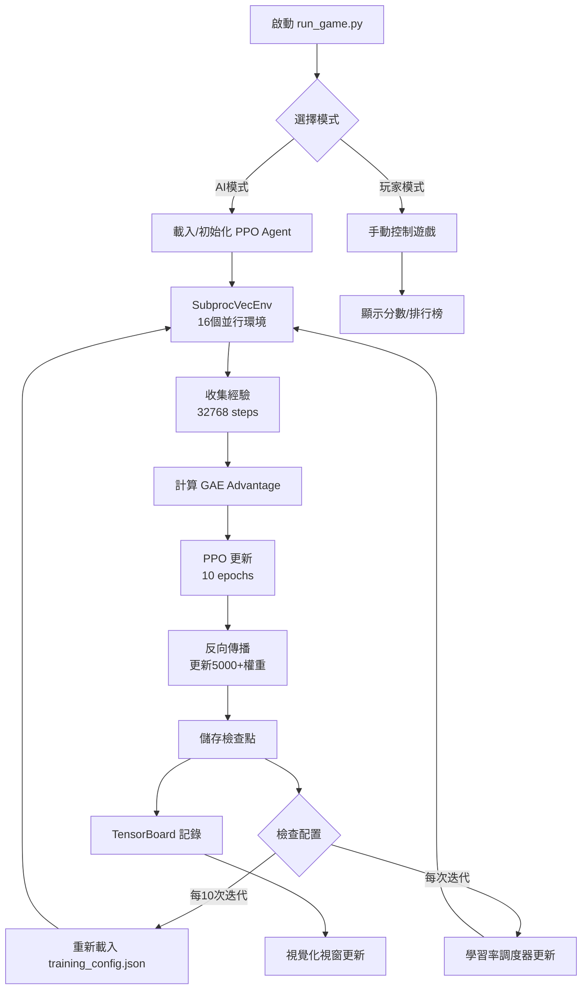
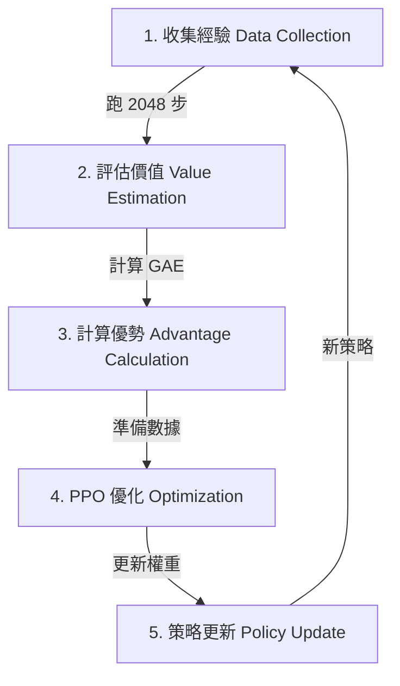

# 🎮 Train Game - 深度強化學習訓練平台

<div align="center">

**基於 Pygame + PyTorch 的 Flappy-like 遊戲環境，採用 PPO (Proximal Policy Optimization) 演算法**

[](https://www.python.org/downloads/)
[](https://pytorch.org/)
[](https://opensource.org/licenses/MIT)

[功能特色](#-功能特色) • [快速開始](#-快速開始) • [架構設計](#-系統架構) • [深度學習原理](#-深度學習原理) • [使用說明](#-使用說明)

</div>

---

## 📋 目錄

- [專案簡介](#-專案簡介)
- [功能特色](#-功能特色)
- [系統架構](#-系統架構)
- [環境配置](#-環境配置)
- [快速開始](#-快速開始)
- [遊戲功能說明](#-遊戲功能說明)
- [深度學習原理](#-深度學習原理)
- [損失函數詳解](#-損失函數詳解)
- [自適應調度器](#-自適應學習率調度器)
- [Actor-Critic 架構圖](#-actor-critic-架構圖aov-system)
- [參數調整指南](#-參數調整指南)
- [故障排除](#-故障排除)

---

## 🎯 專案簡介

**Train Game** 是一個完整的深度強化学习訓練平台，結合了：
- **遊戲環境**：類 Flappy Bird 的 2D 物理引擎
- **AI 演算法**：PPO (Proximal Policy Optimization) 深度強化學習
- **視覺化介面**：實時觀察訓練過程與神經網路狀態
- **自適應系統**：學習率自動調整，無需手動調參

本專案適合：
- 🎓 學習深度強化學習的學生/研究者
- 🔬 研究 PPO 演算法的實際應用
- 🎮 對 AI 遊戲訓練感興趣的開發者
- 🤖 想要理解神經網路訓練過程的初學者

---

## ✨ 功能特色

### 🚀 核心功能
1. **完整 PPO 實現**
   - Actor-Critic 神經網路架構
   - Generalized Advantage Estimation (GAE)
   - 多環境並行訓練 (SubprocVecEnv)
     - **訓練環境**：32 個並行環境，加速經驗收集
     - **評估環境**：4 個獨立環境，用於定期測試模型性能
   - GPU/CPU 自動適配

2. **智能自適應系統**
   - 6 種學習率調度器（adaptive, step, exponential, cosine, reduce_on_plateau, none）
   - 動態配置熱重載（每 10 次迭代自動讀取配置文件）
   - 性能追蹤與自動調整
   - **🌟 三指標追蹤系統**（正反教材學習）
     - 從高分學習成功經驗（max_reward）
     - 從低分識別失敗場景（min_reward）
     - 平衡潛力與穩定性（mean_reward）
     - 自動檢測策略退化並調整學習率

3. **豐富的視覺化**
   - 實時遊戲畫面（AI/人類雙模式）
   - 神經網路權重熱圖
   - 訓練指標曲線（Loss, Reward, Entropy）
   - TensorBoard 深度分析

4. **完整的訓練生態**
   - 自動檢查點保存（每 10 次迭代）
   - **💎 最佳模型保護機制**
     - 自動保存歷史最佳檢查點 (`checkpoint_best.pt`)
     - 優先載入最佳檢查點，防止最佳模型丟失
     - 詳細的權重載入日誌（顯示權重差異）
   - **🛡️ 性能崩潰保護系統**
     - 即時監控三指標性能變化（每 10 次迭代）
     - 自動檢測嚴重退化（>40% 下降）
     - 智能回檔到最佳檢查點
     - 防止參數調整導致的訓練崩潰
   - **🔧 檢查點管理工具**
     - `rollback_tool.py` - 手動回檔到歷史最佳檢查點
     - `checkpoint_manager.py` - 檢查點狀態分析與清理
     - `diagnose_weight_loading.py` - 權重載入診斷工具
   - 排行榜系統
   - 完善的測試套件

### 🎨 使用者介面
- **雙模式切換**：玩家手動控制 ↔ AI 自動訓練
- **即時反饋**：顯示當前分數、訓練迭代數、學習率等
- **神經網路可視化**：觀察 5000+ 個權重的實時變化
- **詳細統計**：每次迭代的損失值、獎勵、梯度範數等

---

## 🏗 系統架構

### 📁 專案結構

```
traingame/
├── 🎮 game/                      # 遊戲環境模組
│   ├── environment.py            # 核心遊戲邏輯（物理引擎、碰撞檢測）
│   ├── ui.py                     # Pygame 使用者介面
│   ├── training_window.py        # 訓練視覺化視窗
│   └── vec_env.py                # 多環境並行包裝器
│
├── 🤖 agents/                    # AI 演算法模組
│   ├── networks.py               # Actor-Critic 神經網路定義
│   ├── ppo_agent.py              # PPO Agent 推理介面
│   ├── pytorch_trainer.py        # PPO 訓練器（核心訓練邏輯）
│   └── trainer.py                # 訓練器基類
│
├── 💾 checkpoints/               # 訓練檢查點
│   ├── checkpoint_XXXX.pt        # 模型權重快照
│   ├── training_meta.json        # 訓練元數據
│   ├── scores.json               # 排行榜數據
│   └── tb/                       # TensorBoard 日誌
│
├── 🧪 tests/                     # 測試套件
│   ├── test_environment.py       # 環境單元測試
│   ├── test_training.py          # 訓練流程測試
│   └── test_ui.py                # UI smoke 測試
│
├── 📄 配置與文檔
│   ├── training_config.json      # 🔥 訓練超參數配置（可熱重載）
│   ├── requirements.txt          # Python 依賴
│   ├── LR_SCHEDULER_GUIDE.md     # 學習率調度器詳細指南
│   ├── PARAMETER_TUNING_GUIDE.md # 參數調整指南
│   └── TRAINING_GUIDE.md         # 訓練故障排除指南
│
└── 🚀 啟動腳本
    ├── run_game.py               # 單視窗遊戲/訓練入口
    └── run_multi_train.py        # 多視窗並行訓練（可選）
```

### 🔄 系統流程圖



### 🧠 AI 訓練循環

```
┌─────────────────────────────────────────────────────────┐
│ 第 N 次訓練迭代                                          │
├─────────────────────────────────────────────────────────┤
│                                                         │
│  1️⃣ 數據收集階段 (Data Collection)                      │
│     ├─ 16 個環境並行運行                                 │
│     ├─ 每個環境運行 2048 步                              │
│     ├─ 總計: 32768 步經驗                                │
│     └─ 記錄: (state, action, reward, next_state, done)  │
│                                                         │
│  2️⃣ 優勢計算階段 (Advantage Estimation)                 │
│     ├─ 計算 TD 誤差: δₜ = rₜ + γV(sₜ₊₁) - V(sₜ)        │
│     ├─ GAE 優勢: Aₜ = Σ(γλ)ⁱδₜ₊ᵢ                       │
│     └─ 回報估計: Rₜ = Aₜ + V(sₜ)                        │
│                                                         │
│  3️⃣ 策略更新階段 (Policy Update)                        │
│     ├─ 重複 10 輪 (ppo_epochs)                          │
│     ├─ 每輪分 128 批 (batch_size=256)                   │
│     ├─ 計算 PPO Loss (見損失函數章節)                    │
│     ├─ 反向傳播: loss.backward()                        │
│     ├─ 梯度裁剪: clip_grad_norm_(0.5)                   │
│     └─ 權重更新: optimizer.step()                       │
│                                                         │
│  4️⃣ 檢查點保存 (每10次迭代)                             │
│     └─ 保存: model_state_dict + optimizer_state_dict    │
│                                                         │
│  5️⃣ 配置重載 (每10次迭代)                               │
│     └─ 讀取 training_config.json 更新超參數              │
│                                                         │
│  6️⃣ 學習率調整 (每次迭代)                               │
│     └─ 根據調度器類型自動調整學習率                       │
│                                                         │
└─────────────────────────────────────────────────────────┘
              ↓
         下一次迭代 (N+1)
```

### 📊 訓練迭代計算方式（重要說明）

#### ⚠️ 訓練迭代是基於「步數」而非「回合數」

這是 PPO 演算法的標準設計，有重要原因：

**1 次訓練迭代的定義**：
```
收集固定數量的步數 = 2048 步/環境 × 16 個環境 = 32,768 步
→ 進行 PPO 更新 → 訓練迭代 +1
```

**關鍵特點**：
- ✅ 每次迭代處理相同數量的數據（32,768 步）
- ✅ 不管這些步數包含多少個回合
- ✅ 不管回合是成功還是失敗

#### 🎯 為什麼用「步數」而非「回合數」？

| 比較項目 | 基於步數（目前） | 基於回合數（不推薦） |
|---------|----------------|-------------------|
| **數據量穩定性** | ✅ 每次固定 32,768 步 | ❌ 波動巨大（50-3000步/回合） |
| **訓練負擔公平** | ✅ 始終處理相同數據量 | ❌ 早期快但品質差，後期慢 |
| **學習率調度** | ✅ 可預測的進度 | ❌ 無法預測數據量 |
| **統計指標** | ✅ 可比較性高 | ❌ 無法比較不同階段 |
| **業界標準** | ✅ PPO 論文標準做法 | ❌ 非主流方法 |

#### 💡 實際訓練場景範例

**早期訓練（AI 表現差）**：
```
每回合約 100 步
32,768 步 ÷ 100 步/回合 = 約 327 個回合
→ 1 次迭代獲得 327 個失敗經驗（快速試錯）
```

**後期訓練（AI 表現好，如 500+ 分）**：
```
每回合約 3000 步
32,768 步 ÷ 3000 步/回合 = 約 10 個回合
→ 1 次迭代獲得 10 個高質量長軌跡（精細優化）
```

**結論**：迭代次數增長變慢是**好事**！代表 AI 正在進步！

#### 📈 如何正確理解訓練進度

**不要只看迭代次數，應該關注**：

| 指標 | 意義 | 查看方式 |
|------|------|---------|
| **總步數 (timesteps)** | 真正的訓練量 | 控制台輸出 |
| **平均分數 (mean_reward)** | 整體表現水準 | TensorBoard 或控制台 |
| **最高分數 (max_reward)** | 潛力上限 | 三指標追蹤系統 |
| **最低分數 (min_reward)** | 穩定性下限 | 三指標追蹤系統 |
| **回合數 (episode_count)** | 每次迭代的回合數 | 控制台輸出 |

**健康的訓練曲線**：
```
第 1000 次迭代：
- 總步數：32,768,000 步
- 平均分數：50 分
- 每次迭代：~100 個回合

第 5000 次迭代：
- 總步數：163,840,000 步  
- 平均分數：500 分 ✅
- 每次迭代：~10 個回合

→ 迭代速度變慢 = AI 在進步！
→ 10 個高質量長軌跡 > 100 個短暫失敗
```

---

## 🛠 環境配置

### 系統需求

| 組件 | 最低配置 | 推薦配置 |
|------|---------|---------|
| **作業系統** | Windows 10/11, Linux, macOS | Windows 11 |
| **Python** | 3.8+ | 3.10+ |
| **記憶體** | 4 GB | 8 GB+ |
| **顯卡** | 無（CPU訓練） | NVIDIA GPU (CUDA 11.8+) |
| **硬碟** | 500 MB | 2 GB (含檢查點) |

### 核心依賴

```txt
numpy==1.26.4          # 數值計算
pygame==2.6.1          # 遊戲引擎
torch==2.2.0           # 深度學習框架
tensorboard==2.16.0    # 訓練視覺化

# 開發工具（可選）
pytest==7.4.2          # 測試框架
black==24.1.0          # 程式碼格式化
ruff==0.13.1           # Linter
```

### GPU 支援 (可選但推薦)

本專案支援 NVIDIA CUDA 加速訓練。如果你有 NVIDIA 顯卡：

**Windows (PowerShell):**
```powershell
# 卸載 CPU 版本
pip uninstall torch torchvision torchaudio -y

# 安裝 CUDA 版本 (依你的 CUDA 版本選擇)
# CUDA 11.8
pip install torch torchvision torchaudio --index-url https://download.pytorch.org/whl/cu118

# CUDA 12.1
pip install torch torchvision torchaudio --index-url https://download.pytorch.org/whl/cu121
```

**驗證 GPU 可用性:**
```powershell
python -c "import torch; print(f'CUDA available: {torch.cuda.is_available()}'); print(f'Device: {torch.cuda.get_device_name(0) if torch.cuda.is_available() else \"CPU\"}')"
```

---

## 🚀 快速開始

### 1️⃣ 克隆專案

```powershell
git clone https://github.com/SmailDot/train_game.git
cd traingame
```

### 2️⃣ 建立虛擬環境

```powershell
# 建立虛擬環境
python -m venv .venv

# 啟用虛擬環境
.\.venv\Scripts\Activate.ps1  # Windows PowerShell
# 或
source .venv/bin/activate     # Linux/macOS
```

### 3️⃣ 安裝依賴

```powershell
# 升級 pip
python -m pip install --upgrade pip

# 基本安裝（CPU 版本）
pip install -r requirements.txt

# GPU 版本（推薦，需 NVIDIA 顯卡）
pip uninstall torch torchvision torchaudio -y
pip install torch torchvision torchaudio --index-url https://download.pytorch.org/whl/cu121
```

### 4️⃣ 驗證安裝

```powershell
# 運行測試套件
python -m pytest -q

# 輸出應該類似:
# .......................                                    [100%]
# 23 passed in 2.50s
```

### 5️⃣ 開始訓練

```powershell
# 啟動遊戲/訓練介面
python run_game.py
```

**第一次啟動流程：**
1. 視窗打開後，按 `A` 鍵切換到 AI 模式
2. AI 會自動開始訓練（16 個並行環境）
3. 觀察視窗右側的訓練指標
4. 檢查點每 10 次迭代自動保存到 `checkpoints/`

### 6️⃣ 監控訓練進度（可選）

```powershell
# 在新終端啟動 TensorBoard
tensorboard --logdir=checkpoints/tb --port=6006

# 打開瀏覽器訪問: http://localhost:6006
```

---

## 🎮 遊戲功能說明

### 🕹️ 控制方式

| 模式 | 按鍵 | 功能 |
|------|------|------|
| **玩家模式** | `SPACE` / `↑` | 跳躍 |
| **模式切換** | `A` 鍵 | AI 模式 ↔ 玩家模式 |
| **訓練控制** | `T` 鍵 | 啟動/停止訓練 |
| **視窗管理** | `W` 鍵 | 開啟/關閉訓練視覺化視窗 |
| **系統** | `ESC` / `Q` | 退出遊戲 |

### 🎯 遊戲規則

#### 物理參數
- **畫面尺寸**: 600px 高度
- **球半徑**: 12 像素
- **重力加速度**: 0.6 px/step²
- **跳躍力**: -7.0 px/step
- **最大速度**: ±20 px/step
- **滾動速度**: 3.0 px/step (基礎)
- **速度增長**: 通過每個障礙物後 +2%

#### 障礙物生成
- **初始距離**: 150 像素
- **障礙物間距**: 250 像素
- **間隙大小**: 160-200 像素（隨機）
- **間隙位置**: 距離頂部/底部至少 150 像素

#### 獎勵機制

| 事件 | 獎勵值 | 說明 |
|------|--------|------|
| **存活** | +0.1 / step | 每一步都存活的基礎獎勵 |
| **通過障礙物** | +5.0 | 成功通過間隙 |
| **碰撞障礙物** | -5.0 | 撞到障礙物頂部/底部 |
| **碰撞邊界** | -5.0 | 撞到天花板/地板 |

**範例計算：**
```
一局遊戲持續 50 步，通過 2 個障礙物：
總獎勵 = (0.1 × 50) + (5.0 × 2) = 5 + 10 = 15 分
```

### 📊 介面元素

#### 主遊戲視窗 (1280×720)
```
┌─────────────────────────────────────────────────────────┐
│  🎮 Train Game - PPO Training                           │
├──────────────────────┬──────────────────────────────────┤
│                      │  📈 訓練狀態                      │
│                      │  ├─ 模式: AI / 玩家               │
│    遊戲畫面          │  ├─ 訓練中: ✓ / ✗                 │
│    (600×600)         │  ├─ 當前分數: XXX                 │
│                      │  ├─ 訓練迭代: XXXX                │
│                      │  ├─ 學習率: 0.000XXX              │
│                      │  └─ 平均獎勵: XX.XX               │
│    🏀 (球體)         │                                   │
│    ║ ║ (障礙物)     │  🏆 排行榜 Top 5                   │
│    ║ ║              │  1. AI-PPO: 1250                  │
│                      │  2. Player: 980                   │
│                      │  ...                              │
└──────────────────────┴──────────────────────────────────┘
```

#### 訓練視覺化視窗 (按 `W` 開啟)
```
┌─────────────────────────────────────────────────────────┐
│  📊 Neural Network Visualization                        │
├─────────────────────────────────────────────────────────┤
│                                                         │
│  🧠 權重熱圖 (5×64 矩陣)                                 │
│  ┌───────────────────────────────────────┐             │
│  │ 🟥🟧🟨🟩🟦🟪 ... (64個神經元)            │             │
│  │ 🟥🟧🟨🟩🟦🟪 ...                        │             │
│  │ ... (5個輸入維度)                      │             │
│  └───────────────────────────────────────┘             │
│                                                         │
│  📉 損失曲線                                             │
│  ├─ Policy Loss: 0.XXX                                 │
│  ├─ Value Loss: 0.XXX                                  │
│  └─ Entropy: 0.XXX                                     │
│                                                         │
└─────────────────────────────────────────────────────────┘
```

### 🎲 狀態空間 (State Space)

AI 觀察的 5 維狀態向量（已歸一化到 [0, 1]）：

```python
state = [
    y / ScreenHeight,           # 球的垂直位置 [0-1]
    vy / MaxAbsVel,             # 球的垂直速度 [-1 ~ 1]
    x_obs / MaxDist,            # 最近障礙物的水平距離 [0-1]
    gap_top / ScreenHeight,     # 間隙頂部位置 [0-1]
    gap_bottom / ScreenHeight   # 間隙底部位置 [0-1]
]
```

**直觀理解：**
- `y = 0.5` → 球在畫面正中央
- `vy = -0.35` → 球正在上升（速度為 -7）
- `x_obs = 0.2` → 障礙物距離球 30 像素
- `gap_top = 0.4, gap_bottom = 0.6` → 間隙在中間，高度 120 像素

### 🎯 動作空間 (Action Space)

離散動作空間（Bernoulli 分佈）：

```python
action = 0  # 不跳（讓重力作用）
action = 1  # 跳躍（施加 -7.0 的向上衝量）
```

---

## 🧠 深度學習原理

### 📐 PPO 演算法概述

**Proximal Policy Optimization (PPO)** 是一種 on-policy 強化學習演算法，結合了：
- **策略梯度** (Policy Gradient)：直接優化策略函數
- **信賴域方法** (Trust Region)：限制策略更新幅度，避免破壞性更新
- **Actor-Critic** 架構：同時學習策略（Actor）和價值函數（Critic）

### 🔄 PPO 訓練流程全解 (Complete Training Flow)

PPO 的訓練並非魔法，而是一個嚴謹的數學循環。以下是它如何一步步讓 AI 變強的完整過程：



#### 步驟 1：收集經驗 (Data Collection)
- **做什麼**：AI 在遊戲中實際遊玩，收集數據。
- **細節**：16 個並行環境同時運行，每個跑 2048 步。
- **產出**：共 32,768 筆 `(狀態, 動作, 獎勵, 下一狀態)` 的數據。
- **關鍵**：此时使用的是「舊策略」($\pi_{old}$)，我們需要這些數據來評估舊策略的好壞。

#### 步驟 2：評估與計算優勢 (Advantage Estimation)
- **做什麼**：事後諸葛亮，分析剛才的每一步走得好不好。
- **工具**：使用 **GAE (Generalized Advantage Estimation)**。
- **邏輯**：
    - 如果某一步導致了高分，則該動作的「優勢」($A_t$) 為正。
    - 如果某一步導致了撞牆，則該動作的「優勢」($A_t$) 為負。
- **產出**：每筆數據都標上了「優勢值」和「目標價值」。

#### 步驟 3：PPO 優化 (Optimization)
- **做什麼**：根據優勢值來調整神經網路。
- **核心機制**：
    - **Actor (策略)**：如果優勢是正的，提高該動作的機率；如果是負的，降低機率。
    - **Critic (價值)**：修正對狀態價值的預測，讓它更準確。
    - **Clipping (裁剪)**：**這是 PPO 的精髓**。如果新策略改變太大（例如機率從 10% 變 90%），PPO 會強制「剪掉」多餘的更新幅度，防止學壞。
- **過程**：將 32,768 筆數據分成小批次 (Minibatches)，重複訓練 10 輪 (Epochs)。

#### 步驟 4：策略更新 (Update)
- **做什麼**：用訓練好的新參數覆蓋舊參數。
- **結果**：AI 變強了一點點。
- **循環**：回到步驟 1，用這個變強的 AI 繼續收集數據。

---

### 🏗️ Actor-Critic 神經網路架構

```python
class ActorCritic(nn.Module):
    def __init__(self, input_dim=5, hidden=64):
        super().__init__()
        self.fc1 = nn.Linear(input_dim, hidden)   # 5 → 64
        self.fc2 = nn.Linear(hidden, hidden)      # 64 → 64
        self.actor = nn.Linear(hidden, 1)         # 64 → 1 (動作logit)
        self.critic = nn.Linear(hidden, 1)        # 64 → 1 (狀態價值)
```

**網路結構視覺化：**

```
輸入層          隱藏層 1         隱藏層 2         輸出層
(5)             (64)            (64)            (2)

  y  ─────┐
  vy ─────┤
  x  ─────┼───► [ReLU] ───► [ReLU] ───┬───► Actor  (動作概率)
  gt ─────┤      64個         64個    │
  gb ─────┘     神經元       神經元    └───► Critic (狀態價值)

總參數量: 
  fc1: 5×64 + 64 = 384
  fc2: 64×64 + 64 = 4,160
  actor: 64×1 + 1 = 65
  critic: 64×1 + 1 = 65
  ─────────────────────
  總計: ~4,674 個參數
```

**前向傳播流程：**

```python
def forward(self, x):
    # x shape: (batch_size, 5)
    x = F.relu(self.fc1(x))      # → (batch_size, 64)
    x = F.relu(self.fc2(x))      # → (batch_size, 64)
    
    logits = self.actor(x)       # → (batch_size, 1)  動作 logit
    value = self.critic(x)       # → (batch_size, 1)  狀態價值
    
    return logits, value
```

---

### 📊 Generalized Advantage Estimation (GAE)

**(對應訓練流程步驟 2：評估與計算優勢)**

**目標：** 估計每個動作的"優勢"（相比平均表現有多好）

#### 步驟 1：計算 TD 誤差
```math
\delta_t = r_t + \gamma V(s_{t+1}) - V(s_t)
```

#### 步驟 2：計算 GAE 優勢
```math
\hat{A}_t = \sum_{l=0}^{\infty} (\gamma \lambda)^l \; \delta_{t+l}
```

#### 步驟 3：回報估計
```math
R_t = \hat{A}_t + V(s_t)
```

---

### 🔄 反向傳播與權重更新

```python
# 完整訓練步驟
for epoch in range(ppo_epochs):  # 重複 10 次
    for batch in data_loader:    # 每批 256 個樣本
        
        # 1. 計算三個損失
        policy_loss = ppo_policy_loss(...)
        value_loss = mse_loss(...)
        entropy = entropy_bonus(...)
        
        # 2. 組合總損失
        loss = policy_loss + 0.5 * value_loss - 0.01 * entropy
        
        # 3. 清空梯度
        optimizer.zero_grad()
        
        # 4. 反向傳播（自動微分）
        loss.backward()
        # 此步驟自動計算所有權重的梯度：
        # ∂loss/∂w₁, ∂loss/∂w₂, ..., ∂loss/∂w₄₆₇₄
        
        # 5. 梯度裁剪（防止梯度爆炸）
        torch.nn.utils.clip_grad_norm_(net.parameters(), max_norm=0.5)
        
        # 6. 更新權重
        optimizer.step()
        # Adam 優化器根據梯度更新權重：
        # wᵢ ← wᵢ - learning_rate × gradient
```

**每次迭代的權重更新量：**

```
總更新次數 = ppo_epochs × (horizon / batch_size)
           = 10 × (32768 / 256)
           = 10 × 128
           = 1,280 次權重更新

每個權重被更新 1,280 次 × 梯度大小 (~0.0001-0.001)
```

---

## 🎛 自適應學習率調度器

### 🔧 配置系統

本專案實現了 6 種學習率調度器，通過 `training_config.json` 配置：

```json
{
    "lr_scheduler": {
        "type": "adaptive",              // 調度器類型
        "patience": 30,                  // 無改善的容忍次數
        "factor": 0.5,                   // 衰減因子
        "min_lr": 1e-6,                  // 最小學習率
        "improvement_threshold": 0.01    // 改善閾值（1%）
    }
}
```

---

### 📊 調度器類型詳解

#### 1️⃣ Adaptive (自定義自適應) ⭐ 推薦

**運作原理：**
```python
if current_reward > best_reward × (1 + threshold):
    best_reward = current_reward
    patience_counter = 0
    print("新最佳獎勵！")
else:
    patience_counter += 1
    
if patience_counter >= patience:
    lr = max(lr × factor, min_lr)
    print(f"降低學習率: {old_lr} → {lr}")
    patience_counter = 0
```

**適用場景：**
- ✅ 獎勵曲線不規則（忽高忽低）
- ✅ 不知道訓練會跑多久
- ✅ 想要自動化調參

**配置範例：**
```json
{
    "type": "adaptive",
    "patience": 30,              // 30次無改善→降低LR
    "factor": 0.5,               // 每次減半
    "min_lr": 1e-6,              // 最低 0.000001
    "improvement_threshold": 0.01 // 改善需>1%才算
}
```

---

#### 2️⃣ Step (階梯式衰減)

**運作原理：**
```python
if iteration % step_size == 0:
    lr = lr × gamma
```

**時間線：**
```
Iteration:  0   100  200  300  400  500
LR:       0.001 0.0009 0.00081 0.000729 ...
          ─────┘      └───┘    └────┘
          每 100 次衰減 ×0.9
```

**適用場景：**
- ✅ 訓練時長已知（如 1000 次迭代）
- ✅ 獎勵曲線平穩
- ❌ 不適合提前停止的訓練

**配置範例：**
```json
{
    "type": "step",
    "step_size": 100,   // 每 100 次迭代
    "gamma": 0.9        // 學習率 ×0.9
}
```

---

#### 3️⃣ Exponential (指數衰減)

**運作原理：**
```python
lr = initial_lr × (gamma ** iteration)
```

**曲線：**
```
0.001 ┤●
      │ ●
0.0008┤  ●
      │   ●
0.0006┤    ●●
      │      ●●
0.0004┤        ●●●
      │           ●●●●
0.0002┤               ●●●●●●●●●●●
      └──────────────────────────────
       0   200  400  600  800  1000 iterations
```

**適用場景：**
- ✅ 長期訓練（>5000 次迭代）
- ✅ 希望平滑衰減
- ❌ 短期訓練會衰減太慢

**配置範例：**
```json
{
    "type": "exponential",
    "gamma": 0.999      // 每次迭代 ×0.999
}
```

---

#### 4️⃣ Cosine (餘弦退火)

**運作原理：**
```python
lr = eta_min + (initial_lr - eta_min) × (1 + cos(π × iteration / T_max)) / 2
```

**曲線（T_max=500）：**
```
0.001 ┤●
      │ ●●
0.0008┤   ●●
      │     ●●
0.0006┤       ●●
      │         ●●
0.0004┤           ●●
      │             ●●
0.0002┤               ●●
      │                 ●●
0.0000┤                   ●
      └────────────────────────
       0   100  200  300  400  500
```

**適用場景：**
- ✅ 訓練迭代數固定
- ✅ 希望平滑降到最小值
- ✅ 想要在末期做精細調整

**配置範例：**
```json
{
    "type": "cosine",
    "T_max": 500,       // 500 次迭代降到最小
    "eta_min": 1e-6     // 最小學習率
}
```

---

#### 5️⃣ Reduce on Plateau (性能停滯降低)

**運作原理：**
```python
if no_improvement_for(patience) iterations:
    lr = lr × factor
```

**適用場景：**
- ✅ 獎勵曲線波動大
- ✅ 需要等待性能真正停滯才降低 LR
- ❌ 可能在過擬合後才反應

**配置範例：**
```json
{
    "type": "reduce_on_plateau",
    "patience": 20,     // 20 次無提升
    "factor": 0.5       // 減半
}
```

---

#### 6️⃣ None (不使用調度器)

固定學習率，適合：
- 短期實驗
- 調試階段
- 手動控制學習率

```json
{
    "type": "none"
}
```

---

### 🔍 如何選擇調度器？

| 情況 | 推薦調度器 | 原因 |
|------|-----------|------|
| **不確定訓練多久** | `adaptive` | 自動適應任意長度 |
| **獎勵波動大** | `adaptive` / `reduce_on_plateau` | 容忍短期波動 |
| **訓練時長固定** | `cosine` / `step` | 按計劃衰減 |
| **長期訓練 (>5000)** | `exponential` / `cosine` | 平滑連續衰減 |
| **首次嘗試** | `adaptive` (patience=30) | 最穩妥 |
| **調試階段** | `none` | 保持簡單 |

---

### 📈 實際訓練範例

**初始配置（adaptive）：**
```json
{
    "type": "adaptive",
    "patience": 30,
    "factor": 0.5,
    "min_lr": 1e-6,
    "improvement_threshold": 0.01
}
```

**訓練過程：**
```
Iteration    Avg Reward    Learning Rate    事件
─────────────────────────────────────────────────────
    0           -5.0         0.00025       初始
  100            2.0         0.00025       緩慢改善
  200            4.5         0.00025       
  250            4.2         0.00025       開始停滯
  280            4.3         0.00025       patience=30
  310            4.1         0.000125      ⚠️ 降低LR (×0.5)
  400            8.5         0.000125      📈 新最佳！
  500           12.0         0.000125      持續進步
  600           11.8         0.000125      
  630           12.1         0.0000625     ⚠️ 再次降低
  800           15.0         0.0000625     📈 新最佳！
 1000           14.9         0.0000625     接近收斂
```

**學習率曲線：**
```
LR
0.00025 ┤●●●●●●●●●●●●●●●●●●●●●●●●●●●●●●●
        │                                 ↓
0.000125┤                             ●●●●●●●●●●●●●
        │                                       ↓
0.000063┤                                   ●●●●●●●●●
        └──────────────────────────────────────────
         0   200   400   600   800  1000  iterations
```

---

### ⚙️ 動態配置熱重載

**重要特性：** 無需重啟訓練，配置自動生效！

```python
# pytorch_trainer.py 中的自動重載邏輯
def _load_dynamic_config(self, iteration):
    if iteration % 10 != 0:  # 每 10 次迭代檢查一次
        return
    
    # 讀取 training_config.json
    with open("training_config.json") as f:
        config = json.load(f)
    
    # 更新超參數
    new_lr = config["gpu_training"]["learning_rate"]
    if new_lr != self.lr:
        for param_group in self.opt.param_groups:
            param_group['lr'] = new_lr
        print(f"⚙️ 學習率已更新: {self.lr} → {new_lr}")
```

**使用流程：**
1. 訓練運行中
2. 編輯 `training_config.json`
3. 儲存文件
4. 等待下一個 10 的倍數迭代（如第 1230 → 1240）
5. 自動生效！✨

**可動態調整的參數：**
- ✅ `learning_rate` - 學習率
- ✅ `batch_size` - 批量大小
- ✅ `ppo_epochs` - PPO 訓練輪數
- ✅ `ent_coef` - 熵係數
- ✅ `vf_coef` - 價值函數係數
- ✅ `clip_range` - PPO 裁剪範圍
- ✅ `gamma` - 折扣因子
- ✅ `gae_lambda` - GAE λ 參數

---

## 🎨 Actor-Critic 架構圖(AOV System)

### 🧠 完整系統架構

```
┌─────────────────────────────────────────────────────────────────────┐
│                        訓練環境 (Training Environment)                │
├─────────────────────────────────────────────────────────────────────┤
│                                                                     │
│  🎮 Game Environment (×16 並行)                                     │
│  ├─ 狀態: [y, vy, x_obs, y_{gap\_top}, y_{gap\_bottom}]          │
│  ├─ 動作: jump (0/1)                                               │
│  └─ 獎勵: +0.1 (存活) / +5.0 (通過) / -5.0 (碰撞)                  │
│                                                                     │
└─────────────────────┬───────────────────────────────────────────────┘
                      │ state (5D vector)
                      ↓
┌─────────────────────────────────────────────────────────────────────┐
│                    Actor-Critic 神經網路                             │
├─────────────────────────────────────────────────────────────────────┤
│                                                                     │
│  📥 輸入層 (5 neurons)                                              │
│     [y_norm, vy_norm, x_norm, gap_top_norm, gap_bottom_norm]        │
│                          │                                          │
│                          │ fc1.weight (5×64)                        │
│                          ↓                                          │
│  🧠 隱藏層 1 (64 neurons) + ReLU                                    │
│     [h1₁, h1₂, h1₃, ..., h1₆₄]                                     │
│                          │                                          │
│                          │ fc2.weight (64×64)                       │
│                          ↓                                          │
│  🧠 隱藏層 2 (64 neurons) + ReLU                                    │
│     [h2₁, h2₂, h2₃, ..., h2₆₄]                                     │
│                          │                                          │
│                 ┌────────┴────────┐                                 │
│                 │                 │                                 │
│         actor.weight (64×1)   critic.weight (64×1)                 │
│                 ↓                 ↓                                 │
│  🎭 Actor 輸出      🎯 Critic 輸出                                   │
│     logit → prob      value                                        │
│     (動作概率)        (狀態價值)                                     │
│                                                                     │
└─────────┬──────────────────────┬────────────────────────────────────┘
          │ action               │ value

```powershell
python -c "from agents.pytorch_trainer import PPOTrainer; t=PPOTrainer(); t.train(total_timesteps=2000)"
```

5. 啟動 pre-commit hooks（確保格式一致）

```powershell
pip install pre-commit
pre-commit install
pre-commit run --all-files
```

## 訓練變數與獎勵

- **狀態** $s_t = [y, v_y, x_{obs}, y_{gap\_top}, y_{gap\_bottom}]$（均已正規化）。
- **動作** $a_t \in \{0,1\}$：0 = 不跳、1 = 跳。
- **獎勵**：
   - 通過障礙：$r_{pass} = +5$
   - 碰撞或飛出上下界：$r_{collision} = -5$
   - 其他時間步：0（已移除時間懲罰）。

## 🧾 訓練公式 (Training formulas)

### 1. 折扣回報 (Discounted Return)

$$
G_t = \sum_{k=0}^{\infty} \gamma^{k} r_{t+k}
$$

**📝 公式含義：**
* **$G_t$ (總回報)**：代表 AI 從當前時間點 $t$ 開始，直到遊戲結束所能獲得的「總分」。
* **$\gamma$ (Gamma, 折扣因子)**：通常設為 0.99。
    * 它的作用是讓 AI **「看重當下，兼顧未來」**。
    * $\gamma$ 越接近 1，AI 越有遠見（在意未來的障礙物）；$\gamma$ 越小，AI 越短視（只想立刻拿分）。
* **$r_{t+k}$**：未來每一步的即時獎勵（例如通過障礙 +5）。

---

### 2. 優勢估計 (GAE - Generalized Advantage Estimation)

$$
\begin{aligned}
\delta_t &= r_t + \gamma V(s_{t+1}) - V(s_t),\\
\hat{A}_t &= \sum_{l=0}^{\infty} (\gamma \lambda)^l \; \delta_{t+l}.
\end{aligned}
$$

**📝 公式含義：**
* **$\delta_t$ (TD Error / 驚喜度)**：
    * 意思就是：「實際發生的結果」跟「AI 原本預期」的落差。
    * 如果 $\delta_t > 0$，代表這一步走得**比預期好**（例如原本以為會撞牆，結果過了）。
* **$\hat{A}_t$ (優勢值)**：
    * 這是 PPO 判斷動作好壞的關鍵指標。
    * **$\hat{A}_t > 0$**：代表在這個狀態下，這個動作是**好的**（優於平均），應該增加機率。
    * **$\hat{A}_t < 0$**：代表這個動作是**壞的**（劣於平均），應該減少機率。
* **$\lambda$ (Lambda)**：平衡偏差與變異數的參數（通常 0.95），決定 AI 要看多遠的「驚喜」。

---

### 3. PPO 裁剪目標 (Clipped Objective) — **核心靈魂**

$$
L^{\mathrm{CLIP}}(\theta) = -\mathbb{E}_t\left[ \min\left( r_t(\theta) \hat{A}_t, \; \text{clip}(r_t(\theta), 1-\epsilon, 1+\epsilon)\, \hat{A}_t \right) \right]
$$

其中概率比率為：

$$
r_t(\theta) = \frac{\pi_{\theta}(a_t\mid s_t)}{\pi_{\theta_{\mathrm{old}}}(a_t\mid s_t)}.
$$

**📝 公式含義：**
* **$r_t(\theta)$ (概率比率)**：比較「新策略」與「舊策略」對同一個動作的喜好程度。
    * $r > 1$：新策略比舊策略更想做這個動作。
    * $r < 1$：新策略想減少做這個動作。
* **$\epsilon$ (Epsilon, 裁剪範圍)**：通常設為 0.2。
    * 這是一個**安全閥**。它限制 $r_t(\theta)$ 只能在 $[0.8, 1.2]$ 之間變動。
    * **作用**：防止 AI 因為一次運氣好的嘗試，就過度自信地大幅修改策略（避免「學壞」或訓練崩潰）。
* **$min$ (取最小值)**：這是悲觀主義的體現。在「原本的優化目標」和「裁剪後的目標」中選比較差的那個，確保更新步伐永遠是安全的。

---

### 4. 值函數與熵項 (Value Function & Entropy)

$$L^{\mathrm{VF}} = \mathbb{E}_t \left[ (V_{\theta}(s_t) - G_t)^2 \right], \qquad S[\pi_{\theta}] = -\sum_a \pi_{\theta}(a \mid s_t) \log \pi_{\theta}(a \mid s_t)$$

**📝 公式含義：**
* **$L^{\mathrm{VF}}$ (價值損失)**：
    * 這是一個**均方誤差 (MSE)**。
    * 目的是訓練 Critic (評論家) 能夠**更準確地預測分數**。若預測不準，AI 就不知道哪個動作真正有價值。
* **$S[\pi_{\theta}]$ (熵 / 隨機性)**：
    * 衡量 AI 策略的「多樣性」。
    * **高熵**：AI 嘗試各種動作（探索期）。
    * **低熵**：AI 只認定一種動作（收斂期）。
    * 在公式中加入這一項（前面帶負號或作為獎勵），是為了**強迫 AI 保持好奇心**，不要太早放棄嘗試新路徑（避免落入局部最優解，如勝率 50% 的困境）。

---

### 5. 總損失函數 (Total Loss)


$$
L = L^{\mathrm{CLIP}} + c_{vf} L^{\mathrm{VF}} - c_{ent} \; S[\pi_{\theta}]
$$

**📝 公式含義：**
這是最終用來更新神經網路的總指標，由三部分組成：
1.  **$L^{\mathrm{CLIP}}$**：讓 Actor (策略) 變強，學會怎麼贏。
2.  **$c_{vf} L^{\mathrm{VF}}$**：讓 Critic (評分) 變準，學會看清局勢。通常 $c_{vf}=0.5$。
3.  **$- c_{ent} S$**：鼓勵探索。通常 $c_{ent}=0.01$。注意這裡是減號（因為我們希望最大化熵，而 Loss 是要被最小化的）。

---

### 1️⃣ 策略損失 (Policy Loss)

**PPO Clipped Objective：**

```
L_policy = -E[ min(rₜ(θ)·Aₜ, clip(rₜ(θ), 1-ε, 1+ε)·Aₜ) ]
```

**📉 策略損失 (Policy Loss)：越低越好**
- 代表模型整體優化程度，結合了策略改進、價值預測準確度和熵正則化。

**詳細拆解：**

#### 概率比率 (Probability Ratio)

```python
# 舊策略的 log 概率（收集數據時）
old_log_prob = log π_old(aₜ | sₜ)

# 新策略的 log 概率（當前網路）
new_log_prob = log π_θ(aₜ | sₜ)

# 概率比率
ratio = exp(new_log_prob - old_log_prob) = π_θ(aₜ | sₜ) / π_old(aₜ | sₜ)
```

**直觀理解：**
- `ratio > 1`: 新策略更傾向選擇這個動作
- `ratio < 1`: 新策略更不傾向選擇這個動作
- `ratio = 1`: 策略沒有改變

#### 裁剪機制 (Clipping)

```python
# 設定裁剪範圍 ε = 0.2
clip_range = 0.2

# 原始目標
surr1 = ratio * advantage

# 裁剪後的目標
surr2 = clip(ratio, 1-ε, 1+ε) * advantage
      = clip(ratio, 0.8, 1.2) * advantage

# 取較小值（保守更新）
policy_loss = -min(surr1, surr2).mean()
```

**裁剪範圍視覺化：**

```
Advantage > 0 (好的動作):
    ratio ∈ [0, 0.8]  → 不鼓勵降低概率（限制在0.8）
    ratio ∈ [0.8, 1.2] → 正常更新
    ratio ∈ [1.2, ∞]  → 不過度提高概率（限制在1.2）

Advantage < 0 (壞的動作):
    ratio ∈ [0, 0.8]  → 正常降低概率
    ratio ∈ [0.8, 1.2] → 正常更新
    ratio ∈ [1.2, ∞]  → 不鼓勵提高概率（限制在1.2）
```

**完整 Python 實現：**

```python
def ppo_policy_loss(states, actions, old_log_probs, advantages, clip_range=0.2):
    # 前向傳播
    logits, _ = self.net(states)
    prob = torch.sigmoid(logits)
    dist = torch.distributions.Bernoulli(probs=prob)
    
    # 新策略的 log 概率
    new_log_probs = dist.log_prob(actions)
    
    # 概率比率
    ratio = torch.exp(new_log_probs - old_log_probs)
    
    # 兩個目標
    surr1 = ratio * advantages
    surr2 = torch.clamp(ratio, 1.0 - clip_range, 1.0 + clip_range) * advantages
    
    # 取最小值並加負號（梯度上升 → 梯度下降）
    policy_loss = -torch.min(surr1, surr2).mean()
    
    return policy_loss
```

---

### 2️⃣ 價值函數損失 (Value Loss)

**均方誤差 (MSE)：**

```
L_value = MSE(V(sₜ), Rₜ) = 1/N Σ (V(sₜ) - Rₜ)²
```

**📉 價值損失 (Value Loss)：越低越好**
- 代表 Critic 預測的準確度。
- 損失越低，表示 Critic 對當前狀態價值的估計越接近真實回報。

**Python 實現：**

```python
def value_loss(states, returns):
    _, value = self.net(states)
    loss = F.mse_loss(value, returns)
    return loss
```

**作用：** 訓練 Critic 更準確地預測未來累積獎勵。

---

### 3️⃣ 熵損失 (Entropy Loss)

**Bernoulli 分佈熵：**

```
H(π) = -Σ [p·log(p) + (1-p)·log(1-p)]
```

其中 `p` 是跳躍概率。

**📈 熵 (Entropy)：越高越好（初期）**
- 代表策略的隨機性與探索能力。
- 初期應保持較高（約 0.693 對於二元動作），以確保充分探索。
- 後期隨著策略確定，熵會自然下降。

**Python 實現：**

```python
def entropy_loss(states):
    logits, _ = self.net(states)
    prob = torch.sigmoid(logits)
    dist = torch.distributions.Bernoulli(probs=prob)
    entropy = dist.entropy().mean()
    return entropy
```

**作用：** 
- 高熵 = 策略更隨機 = 更多探索
- 低熵 = 策略更確定 = 更多利用
- 係數 `c₂ = 0.01` 微弱地鼓勵探索

---

