# 🎮 Train Game - 深度強化學習訓練平台

**基於 Pygame + PyTorch 的 Flappy-like 遊戲環境，採用 PPO (Proximal Policy Optimization) 演算法**

---

## 🏆 最終成果 (v5 Final)
- **通關率**: **99%** (100 場測試中獲勝 99 場)
- **最高分**: **7647** (平均獎勵)
- **最佳模型**: `models/ppo_game2048_6666_final.zip`

---

## 🎥 演示 (Demo)
> - [AI 遊玩影片 ]
> - 
> - [訓練日誌 GIF (v5 Refined)]
> - 

---

## 📋 目錄

- [功能說明](#-功能說明)
- [系統結構圖](#-系統結構圖)
- [專案特徵設計](#-專案特徵設計)
- [訓練公式詳解](#-訓練公式詳解)
- [PPO 介紹](#-ppo-介紹)
- [損失函數參數意義](#-損失函數參數意義)

---

## 🚀 功能說明

本專案是一個完整的深度強化學習 (Deep Reinforcement Learning) 實驗平台，專為訓練 AI 玩類 Flappy Bird 遊戲而設計。

### 核心功能
1.  **高效並行訓練**：
    - 使用 **32 個並行環境 (Parallel Environments)** 進行訓練，極大化經驗收集速度。
    - 額外配置 **4 個獨立評估環境**，用於定期測試模型真實性能。
2.  **強大的 PPO 演算法**：
    - 採用 **Stable-Baselines3** 的 PPO 實作。
    - 客製化神經網路架構 (MLP 256x256)，專為高精度控制優化。
3.  **智能訓練機制**：
    - **Auto-Resume (自動恢復)**：訓練中斷後，可自動讀取最新的 Checkpoint 繼續訓練，無需重頭開始。
    - **動態難度調整**：隨著 AI 變強，遊戲速度與障礙物難度會自動提升。
4.  **完整視覺化與監控**：
    - 支援 **TensorBoard** 即時監控 Loss、Reward、Entropy 等指標。
    - 提供 **Replay (重播)** 功能，可視覺化觀看 AI 的實際操作表現。

---

## 📊 系統結構圖

### AOV 結構圖 (System Architecture)

數據在系統中的流動與處理順序：

```mermaid
graph TD
    %% === Start & Init ===
    Start(["🚀 開始訓練 (Start)"]) --> CheckCkp{"📂 有存檔嗎？"}
    
    CheckCkp -- "有 (Auto-Resume)" --> Load["📥 讀檔：接著上次的進度練<br>(Load Checkpoint)"]
    CheckCkp -- "沒有" --> Init["🆕 創一個全新的 AI<br>(Init New Policy)"]
    
    Load --> Envs
    Init --> Envs

    %% === Environment Setup ===
    subgraph EnvSetup ["⚙️ 環境準備 (Environment Setup)"]
        direction TB
        Envs["🖥️ 開 32 個遊戲視窗 (Parallel Envs)"]
        Envs --> Wrap1["未來視：了解4張圖的路徑<br>(FrameSkip)"]
        Wrap1 --> Wrap2["濾鏡：統一度量衡<br>(VecNormalize)"]
    end

    Wrap2 --> Rollout

    %% === Training Loop ===
    subgraph TrainLoop ["🔄 訓練迴圈 (Training Loop)"]
        direction TB
        
        %% Step 1: Interaction
        Rollout["🎮 讓 AI 實際上場玩 (Rollout)"]
        Rollout -- "看到 7 種數據資訊" --> Agent["AI 決定怎麼走 (Actor)"]
        Agent -- "按下按鍵" --> Step["遊戲畫面動一下 (Physics Step)"]
        
        %% Step 2: Feedback
        Step -- "回傳結果 " --> Buffer["📝 寫進「紀錄日誌」<br>(RolloutBuffer)"]
        
        %% Step 3: Optimization
        Buffer -- "日誌寫滿了嗎？" --> Update{"開始特訓？"}
        Update -- "還沒" --> Rollout
        Update -- "滿了" --> Algo["🧠 PPO 核心大腦"]
        
        Algo -- "算算剛才那樣走好不好，是否還有需要優化的參數" --> Loss["📉 計算跟標準答案差多少<br>(Loss Calculation)"]
        Loss -- "自適應調整 (Backprop)" --> Opt["⚖️ 調整大腦參數<br>(Update Weights)"]
    end

    Opt --> EvalCheck{"⏱️ 該隨堂考了嗎？<br>(Periodic Eval)"}
    EvalCheck -- "還沒" --> Rollout

    %% === Evaluation & Save ===
    subgraph EvalLoop ["📊 考試與存檔 (Evaluation)"]
        direction TB
        EvalCheck -- "該考了" --> Test["🧪 隨堂測驗 (4 個考場)"]
        Test --> Metrics["📈 結算成績單"]
        
        Metrics --> Log["📝 紀錄到 TensorBoard"]
        Log --> SaveBest{"🏆 破紀錄了嗎？"}
        
        SaveBest -- "破紀錄了" --> Save1["💾 把最強的存起來"]
        SaveBest -- "沒破" --> GoalCheck
        Save1 --> GoalCheck
        
        GoalCheck{"🎯 勝率 > 90%？"}
    end

    GoalCheck -- "還沒 (繼續練)" --> Rollout
    GoalCheck -- "達標 (收工)" --> Stop(["🎉 訓練畢業 (Success)"])
```

### BREAK DOWN (系統分析圖)

```mermaid
graph TD
    %% === L1 Core ===
    Core("🎮 深度強化學習訓練平台<br>(Train Game AI - v5)")

    %% === L2 Main Branches ===
    Core --> EnvBlock
    Core --> AgentBlock
    Core --> SysBlock

    %% === Branch 1: Environment ===
    subgraph EnvBlock ["📍 遊戲環境 (Game Environment)"]
        direction TB
        Env("環境核心") --> Obs("觀察空間<br>(Observation)")
        Env --> Rew("獎勵重塑<br>(Reward Shaping)")
        Env --> Act("動作空間<br>(Action)")
        
        %% Obs Details
      Obs --> ObsList["7維輸入向量:<br>1. y (玩家目前高度)<br>2. vy (垂直速度)<br>3. x_obs (距下一個障礙物的水平距離)<br>4. gap_top (縫隙上緣的 Y 座標)<br>5. gap_bottom (縫隙下緣的 Y 座標)<br>6. rel_top (距縫隙上緣的相對距離)<br>7. rel_bottom (距縫隙下緣的相對距離)"]
        Obs --> Norm[" VecNormalize<br>(數值標準化)"]

        %% Reward Details (Updated for v5)
        Rew --> RA("成就 (Achievement)")
        RA --> RA1["通關 (+1000)"]
        RA --> RA2["保持存活(+0.01)"]
        RA --> RA3["通過障礙 (+5)"]

        Rew --> RG("引導 (Guidance)")
        RG --> RG1["Survival (存活獎勵)<br>(核心驅動力)"]
        RG --> RG2["Alignment (中心對齊)<br>(低權重輔助)"]

        Rew --> RP("懲罰 (Penalty)")
        RP --> RP1["Death (-5)<br>(撞牆/出界)"]
        %% 移除了 Time Cost，因為 v5 不再使用

        %% Action Details
        Act --> ActList["Discrete(2):<br>0: 不跳 / 1: 跳躍"]
    end

    %% === Branch 2: Agent ===
    subgraph AgentBlock ["🧠 PPO 決策模型 (Agent)"]
        direction TB
        Agent("PPO 模型") --> Net("神經網路 (v5)")
        Agent --> Opt("優化機制")

        %% Network Details (Updated to 256)
        Net --> N1["Input Layer (7 Nodes)"]
        Net --> N2["Hidden 1 (256, ReLU)"]
        Net --> N3["Hidden 2 (256, ReLU)"]
        Net --> N4["Output Layer (2 Nodes)"]

        %% Optimization Details
        Opt --> O1["Clip Loss<br>(限制更新幅度)"]
        Opt --> O2["Value Loss<br>(局勢判斷)"]
        Opt --> O3["Entropy Loss<br>(探索好奇心)"]
    end

    %% === Branch 3: System ===
    subgraph SysBlock ["⚙️ 訓練系統 (System)"]
        direction TB
        Sys("系統架構") --> Comp("運算配置")
        Sys --> Tools("輔助工具")

        %% Computation
        Comp --> C1["32 Parallel Envs"]
        Comp --> C2["FrameSkip: 4<br>(決策跳幀)"]
        Comp --> C3["Total Timesteps<br>(5M+)"]

        %% Tools
        Tools --> T1["Auto-Resume<br>(自動續訓)"]
        Tools --> T2["TensorBoard<br>(數據監控)"]
        Tools --> T3["Replay Render<br>(回放)"]
    end
```

---

## 🎨 專案特徵設計

### 1. 觀察空間 (Observation Space)
AI 並非直接看像素 (Pixels)，而是接收一個 **7 維的正規化向量**，這讓訓練更高效：

| 參數 | 說明 | 範圍 (正規化後) |
| :--- | :--- | :--- |
| `y` | 玩家垂直位置 | [0, 1] |
| `vy` | 玩家垂直速度 | [-1, 1] |
| `x_obs` | 距離下一個障礙物的水平距離 | [0, 1] |
| `gap_top` | 縫隙上緣位置 | [0, 1] |
| `gap_bottom` | 縫隙下緣位置 | [0, 1] |
| `rel_top` | 玩家距離縫隙上緣的相對距離 | [-1, 1] |
| `rel_bottom` | 玩家距離縫隙下緣的相對距離 | [-1, 1] |

### 2. 動作空間 (Action Space)
- **類型**：離散 (Discrete)
- **動作**：
    - `0`：**不跳** (受重力下墜)
    - `1`：**跳躍** (獲得向上速度)

### 3. 獎勵函數設計 (Reward Shaping)
這是引導 AI 行為的關鍵：

| 行為 | 獎勵值 | 設計目的 |
| :--- | :--- | :--- |
| **通關 (Win)** | **+1000.0** | 鼓勵 AI 追求最終勝利 (6666分)，而不僅僅是生存。 |
| **通過障礙** | **+5.0** | 給予階段性成就感，引導 AI 穿越縫隙。 |
| **位置對齊** | +0.05 (max) | 引導 AI 盡量保持在縫隙中央，減少碰撞風險。 |
| **存活獎勵** | **+0.01 / step** | 鼓勵 AI 活得越久越好 (取代舊版的時間懲罰)。 |
| **碰撞/出界** | **-5.0** | 強烈懲罰死亡，讓 AI 學會避開危險。 |

### 4. 神經網路架構
- **架構**：MLP (多層感知機)
- **規模**：`[256, 256]` (兩層隱藏層，每層 256 個神經元)
- **激活函數**：ReLU

---

## 🧾 訓練公式詳解

在 PPO 訓練過程中，公式的計算是有**先後順序**的。以下依序說明：

### 第一步：計算折扣回報 (Discounted Return)
首先，我們要算出「這一場遊戲到底拿了多少分」。

$$
G_t = \sum_{k=0}^{\infty} \gamma^{k} r_{t+k}
$$

*   **含義**：從時間點 $t$ 開始，把未來所有的獎勵 $r$ 加總起來。
*   **$\gamma$ (Gamma)**：折扣因子。讓未來的獎勵「打折」，越遠的獎勵價值越低。

### 第二步：計算優勢 (Advantage Estimation - GAE)
接著，我們要評估「這一步走得比預期好多少？」。

$$
\hat{A}_t = \sum_{l=0}^{\infty} (\gamma \lambda)^l \delta_{t+l}
$$

*   **含義**：這是 PPO 判斷動作好壞的核心。
*   **$\delta_t$ (TD Error)**：實際發生的事 - 預期會發生的事。
*   **$\lambda$ (Lambda)**：平滑因子，用來平衡偏差與變異數。

### 第三步：計算概率比率 (Probability Ratio)
比較「新策略」和「舊策略」對同一個動作的看法。

$$
r_t(\theta) = \frac{\pi_{\theta}(a_t|s_t)}{\pi_{\theta_{old}}(a_t|s_t)}
$$

*   **含義**：如果 $r_t > 1$，代表新策略比舊策略更喜歡這個動作。

### 第四步：計算裁剪目標 (Clipped Objective)
這是 PPO 防止「學壞」的關鍵步驟。

$$
L^{CLIP}(\theta) = -\mathbb{E}_t \left[ \min(r_t(\theta)\hat{A}_t, \text{clip}(r_t(\theta), 1-\epsilon, 1+\epsilon)\hat{A}_t) \right]
$$

*   **含義**：如果新策略改變太大（超過 $\epsilon$ 範圍），就強制截斷，不讓它更新那麼多。這保證了訓練的穩定性。

### 第五步：計算總損失 (Total Loss)
最後，將所有目標結合，變成神經網路要優化的最終數字。

$$
L = L^{CLIP} + c_{vf} L^{VF} - c_{ent} S
$$

---

### 最終模型的Loss Function圖

[查看Loss Function](2d_loss_plot_PPO_6666_Profile_200k.html)

**Mean Episode Reward** (平均回合獎勵)：最重要。直接告訴你模型強不強。如果這個不升反降，其他參數再漂亮都沒用。

**Value Loss** (價值損失)：大腦的準度。模型對局勢判斷準不準。如果這個一直很高或震盪，代表模型「看不懂」現在的盤面。

**Policy Gradient Loss** (策略梯度損失)：學習的幅度。代表模型修正自己行為的力度。如果這個值長期為 0，代表模型停止學習了；如果震盪太大，代表學習太激進（可能學壞）。

**Entropy Loss** (熵損失)：心態。代表模型是「勇於嘗試」（高 Entropy）還是「保守行事」（低 Entropy）。這用來判斷模型是否過早收斂（太早放棄嘗試新招）或一直學不會（一直亂試）。

---

## 🧠 PPO 介紹

**Proximal Policy Optimization (近端策略優化)**

PPO 是目前最流行的深度強化學習演算法之一，由 OpenAI 提出。

### 核心概念
1.  **On-Policy (在線策略)**：AI 一邊玩，一邊學習。它只能使用「自己當前策略」產生的經驗來學習，不能使用別人的或過去的經驗。
2.  **Trust Region (信任區域)**：PPO 的核心思想是「不要改太多」。它限制了每次策略更新的幅度，確保新的策略不會偏離舊策略太遠。
3.  **Clipping (裁剪)**：這是 PPO 實現信任區域的方法。它直接把概率比率 $r_t(\theta)$ 限制在 $[1-\epsilon, 1+\epsilon]$ 之間，簡單粗暴但非常有效。

### 為什麼選擇 PPO？
- **穩定性高**：不容易因為參數設錯而導致訓練崩潰。
- **調參簡單**：相比於 DQN 或 DDPG，PPO 對超參數不那麼敏感。
- **適用性廣**：既能玩離散動作遊戲 (如 Super Mario)，也能玩連續動作遊戲 (如 機器人控制)。

---

## 📉 損失函數參數意義

在總損失函數 $L = L^{CLIP} + c_{vf} L^{VF} - c_{ent} S$ 中，各參數代表：

| 參數符號 | 英文名稱 | 中文含義 | 典型值 | 作用詳解 |
| :--- | :--- | :--- | :--- | :--- |
| **$\gamma$** | Gamma | 折扣因子 | 0.99 | 決定 AI 有多「遠見」。接近 1 代表 AI 很在意未來的死活；接近 0 代表 AI 只想現在立刻拿分。 |
| **$\lambda$** | Lambda | GAE 因子 | 0.95 | 平衡「估計值」與「實際值」的權重。用來計算優勢函數 $\hat{A}_t$。 |
| **$\epsilon$** | Epsilon | 裁剪範圍 | 0.1 ~ 0.2 | **安全閥**。限制策略更新的幅度，防止 AI 因為一次運氣好就過度自信。 |
| **$c_{vf}$** | VF Coef | 價值係數 | 0.5 ~ 1.0 | 決定我們要花多少力氣去訓練 Critic (評論家)。如果太低，AI 會搞不清楚狀況；太高則會忽略策略本身的優化。 |
| **$c_{ent}$** | Ent Coef | 熵係數 | 0.01 | **好奇心**。這個值越高，AI 越喜歡嘗試隨機動作（探索）；這個值越低，AI 越傾向於固守已知的打法（利用）。 |

---

## 📜 專案演進史 (Version History)

本專案經歷了多次架構重構與機制優化，從自製 PPO 到採用成熟的 Stable-Baselines3-PPO 框架，並透過獎勵重塑 (Reward Shaping) 達到最佳效果。

| 階段 | 核心演算法 | 神經網路節點 (Neural Network Nodes) | 分數里程碑 | 新增 (+) / 移除 (-) 機制與效果 | 遇到的問題 (Pain Points) | 解決方案 (Solution) |
| :--- | :--- | :--- | :--- | :--- | :--- | :--- |
| **初代 (v1)** | 自製 PPO | `[64, 64]` | ~100 分 | **+** 基礎 PPO 架構 (建立基準) **+** 通過障礙 +5 (基礎目標) **+** 時間懲罰 (強迫移動) | 分數一直不太好看，**時間懲罰**導致 AI 為了避免扣分而傾向消極不動，或無法有效學習長期策略。 | 建立基礎訓練架構，確認環境可行性。 |
| **改進版 (v2)** | 自製 PPO | `[64, 64]` | ~800 分 | **+** 三指標追蹤 (監控穩定性) **+** 極端值紀錄 (防止遺忘) **+** NN 視覺化 (觀察思考) | 雖有改善但仍無法通關。紀錄僅限 50 筆，導致後期發生 **"災難性遺忘"**，訓練反而退步成 0 分。 | 引入 **"極端值紀錄"** 機制，強制 PPO 記住最高與最低分的軌跡，輔助收斂。 |
| **轉型期 (v3)** | **Stable-Baselines3-PPO** | `[256, 256]` | ~1000 分 | **+** SB3 框架 (GPU 加速/標準化) **+** Replay 重播機制 (視覺驗證) **-** 移除自製 PPO (升級架構) **-** 移除極端值紀錄 (不相容) **-** 移除 NN 視覺化 (不相容) | 雖然 GPU 訓練速度大幅提升，但 **Headless 模式**無法看到遊玩過程；且移除了記憶機制後，AI 容易陷入局部最佳解。 | **升級至 SB3 PPO** 獲得更穩定的梯度更新；開發 **"Replay 重播機制"** 進行視覺化驗證。 |
| **現行版 (v4)** | **Stable-Baselines3-PPO** | `[512, 512]` | **3000~4000+ 分** | **+** 中心對齊獎勵 (提升精準度) **+** 速度/里程碑獎勵 (鼓勵推進) **+** **存活時間獎勵 (堅持)** **+** 課程學習 (動態難度) **+** **透視機制 (預判路徑)** **-** 移除扣分制 (避免消極) **-** 移除固定通過獎勵 (改為連續) | 隨著速度變快，AI 反應不及；舊獎勵機制限制了上限。 | **Reward Shaping**： 1. **透視機制**：讓 AI 看到下一個障礙物，提前規劃路徑。 2. **引導驅動**：移除扣分，改為越靠近中心分數越高。 |
| **最新版 (v5)** | **SB3-PPO + FrameSkip** | `[256, 256]` | **目標通關** | **+** **Frame Skip (4 frames)** (降低決策頻率) **+** **縮小網路規模** (避免過擬合) **-** 移除速度獎勵 (避免干擾) **-** 降低對齊獎勵 (避免動作僵硬) | 訓練五千萬步仍未收斂，AI 無法判斷自身動量，導致在高速狀態下反應不及。 | **Frame Skip** 讓 AI 決策更有效率；**縮小網路** 加快收斂速度。 |
| **最終版 (v5 Final)** | **SB3-PPO + Auto-Stop** | `[256, 256]` | **通關 (99% 勝率)** | **+** **Target Win Rate** (自動停損) **+** **Death Interrupt** (死亡中斷) **+** **Linear Schedule** (線性衰減) | 訓練後期震盪，無法穩定通關。 | **Shock Therapy** (高熵探索) + **Stabilization** (低熵收斂) 兩階段訓練法。 |

