# 🎮 Train Game - 深度強化學習訓練平台

<div align="center">

**基於 Pygame + PyTorch 的 Flappy-like 遊戲環境，採用 PPO (Proximal Policy Optimization) 演算法**

[](https://www.python.org/downloads/)
[](https://pytorch.org/)
[](https://opensource.org/licenses/MIT)

[功能特色](#-功能特色) • [快速開始](#-快速開始) • [架構設計](#-系統架構) • [深度學習原理](#-深度學習原理) • [使用說明](#-使用說明)

</div>

---

## 📋 目錄

- [專案簡介](#-專案簡介)
- [功能特色](#-功能特色)
- [系統架構](#-系統架構)
- [環境配置](#-環境配置)
- [快速開始](#-快速開始)
- [遊戲功能說明](#-遊戲功能說明)
- [深度學習原理](#-深度學習原理)
- [損失函數詳解](#-損失函數詳解)
- [自適應調度器](#-自適應學習率調度器)
- [Actor-Critic 架構圖](#-actor-critic-架構圖aov-system)
- [參數調整指南](#-參數調整指南)
- [故障排除](#-故障排除)

---

## 🎯 專案簡介

**Train Game** 是一個完整的深度強化學習訓練平台，結合了：
- **遊戲環境**：類 Flappy Bird 的 2D 物理引擎
- **AI 演算法**：PPO (Proximal Policy Optimization) 深度強化學習
- **視覺化介面**：實時觀察訓練過程與神經網路狀態
- **自適應系統**：學習率自動調整，無需手動調參

本專案適合：
- 🎓 學習深度強化學習的學生/研究者
- 🔬 研究 PPO 演算法的實際應用
- 🎮 對 AI 遊戲訓練感興趣的開發者
- 🤖 想要理解神經網路訓練過程的初學者

---

## ✨ 功能特色

### 🚀 核心功能
1. **完整 PPO 實現**
   - Actor-Critic 神經網路架構
   - Generalized Advantage Estimation (GAE)
   - 多環境並行訓練 (SubprocVecEnv)
   - GPU/CPU 自動適配

2. **智能自適應系統**
   - 6 種學習率調度器（adaptive, step, exponential, cosine, reduce_on_plateau, none）
   - 動態配置熱重載（每 10 次迭代自動讀取配置文件）
   - 性能追蹤與自動調整

3. **豐富的視覺化**
   - 實時遊戲畫面（AI/人類雙模式）
   - 神經網路權重熱圖
   - 訓練指標曲線（Loss, Reward, Entropy）
   - TensorBoard 深度分析

4. **完整的訓練生態**
   - 自動檢查點保存
   - 訓練恢復機制
   - 排行榜系統
   - 完善的測試套件

### 🎨 使用者介面
- **雙模式切換**：玩家手動控制 ↔ AI 自動訓練
- **即時反饋**：顯示當前分數、訓練迭代數、學習率等
- **神經網路可視化**：觀察 5000+ 個權重的實時變化
- **詳細統計**：每次迭代的損失值、獎勵、梯度範數等

---

## 🏗 系統架構

### 📁 專案結構

```
traingame/
├── 🎮 game/                      # 遊戲環境模組
│   ├── environment.py            # 核心遊戲邏輯（物理引擎、碰撞檢測）
│   ├── ui.py                     # Pygame 使用者介面
│   ├── training_window.py        # 訓練視覺化視窗
│   └── vec_env.py                # 多環境並行包裝器
│
├── 🤖 agents/                    # AI 演算法模組
│   ├── networks.py               # Actor-Critic 神經網路定義
│   ├── ppo_agent.py              # PPO Agent 推理介面
│   ├── pytorch_trainer.py        # PPO 訓練器（核心訓練邏輯）
│   └── trainer.py                # 訓練器基類
│
├── 💾 checkpoints/               # 訓練檢查點
│   ├── checkpoint_XXXX.pt        # 模型權重快照
│   ├── training_meta.json        # 訓練元數據
│   ├── scores.json               # 排行榜數據
│   └── tb/                       # TensorBoard 日誌
│
├── 🧪 tests/                     # 測試套件
│   ├── test_environment.py       # 環境單元測試
│   ├── test_training.py          # 訓練流程測試
│   └── test_ui.py                # UI smoke 測試
│
├── 📄 配置與文檔
│   ├── training_config.json      # 🔥 訓練超參數配置（可熱重載）
│   ├── requirements.txt          # Python 依賴
│   ├── LR_SCHEDULER_GUIDE.md     # 學習率調度器詳細指南
│   ├── PARAMETER_TUNING_GUIDE.md # 參數調整指南
│   └── TRAINING_GUIDE.md         # 訓練故障排除指南
│
└── 🚀 啟動腳本
    ├── run_game.py               # 單視窗遊戲/訓練入口
    └── run_multi_train.py        # 多視窗並行訓練（可選）
```

### 🔄 系統流程圖

```mermaid
graph TD
    A[啟動 run_game.py] --> B{選擇模式}
    B -->|玩家模式| C[手動控制遊戲]
    B -->|AI模式| D[載入/初始化 PPO Agent]
    
    D --> E[SubprocVecEnv<br/>16個並行環境]
    E --> F[收集經驗<br/>32768 steps]
    F --> G[計算 GAE Advantage]
    G --> H[PPO 更新<br/>10 epochs]
    
    H --> I[反向傳播<br/>更新5000+權重]
    I --> J[儲存檢查點]
    J --> K{檢查配置}
    K -->|每10次迭代| L[重新載入 training_config.json]
    K -->|每次迭代| M[學習率調度器更新]
    
    L --> E
    M --> E
    
    C --> N[顯示分數/排行榜]
    J --> O[TensorBoard 記錄]
    O --> P[視覺化視窗更新]
```



### 🧠 AI 訓練循環

```
┌─────────────────────────────────────────────────────────┐
│ 第 N 次訓練迭代                                          │
├─────────────────────────────────────────────────────────┤
│                                                         │
│  1️⃣ 數據收集階段 (Data Collection)                      │
│     ├─ 16 個環境並行運行                                 │
│     ├─ 每個環境運行 2048 步                              │
│     ├─ 總計: 32768 步經驗                                │
│     └─ 記錄: (state, action, reward, next_state, done)  │
│                                                         │
│  2️⃣ 優勢計算階段 (Advantage Estimation)                 │
│     ├─ 計算 TD 誤差: δₜ = rₜ + γV(sₜ₊₁) - V(sₜ)        │
│     ├─ GAE 優勢: Aₜ = Σ(γλ)ⁱδₜ₊ᵢ                       │
│     └─ 回報估計: Rₜ = Aₜ + V(sₜ)                        │
│                                                         │
│  3️⃣ 策略更新階段 (Policy Update)                        │
│     ├─ 重複 10 輪 (ppo_epochs)                          │
│     ├─ 每輪分 128 批 (batch_size=256)                   │
│     ├─ 計算 PPO Loss (見損失函數章節)                    │
│     ├─ 反向傳播: loss.backward()                        │
│     ├─ 梯度裁剪: clip_grad_norm_(0.5)                   │
│     └─ 權重更新: optimizer.step()                       │
│                                                         │
│  4️⃣ 檢查點保存 (每10次迭代)                             │
│     └─ 保存: model_state_dict + optimizer_state_dict    │
│                                                         │
│  5️⃣ 配置重載 (每10次迭代)                               │
│     └─ 讀取 training_config.json 更新超參數              │
│                                                         │
│  6️⃣ 學習率調整 (每次迭代)                               │
│     └─ 根據調度器類型自動調整學習率                       │
│                                                         │
└─────────────────────────────────────────────────────────┘
              ↓
         下一次迭代 (N+1)
```

---

## 🛠 環境配置

### 系統需求

| 組件 | 最低配置 | 推薦配置 |
|------|---------|---------|
| **作業系統** | Windows 10/11, Linux, macOS | Windows 11 |
| **Python** | 3.8+ | 3.10+ |
| **記憶體** | 4 GB | 8 GB+ |
| **顯卡** | 無（CPU訓練） | NVIDIA GPU (CUDA 11.8+) |
| **硬碟** | 500 MB | 2 GB (含檢查點) |

### 核心依賴

```txt
numpy==1.26.4          # 數值計算
pygame==2.6.1          # 遊戲引擎
torch==2.2.0           # 深度學習框架
tensorboard==2.16.0    # 訓練視覺化

# 開發工具（可選）
pytest==7.4.2          # 測試框架
black==24.1.0          # 程式碼格式化
ruff==0.13.1           # Linter
```

### GPU 支援 (可選但推薦)

本專案支援 NVIDIA CUDA 加速訓練。如果你有 NVIDIA 顯卡：

**Windows (PowerShell):**
```powershell
# 卸載 CPU 版本
pip uninstall torch torchvision torchaudio -y

# 安裝 CUDA 版本 (依你的 CUDA 版本選擇)
# CUDA 11.8
pip install torch torchvision torchaudio --index-url https://download.pytorch.org/whl/cu118

# CUDA 12.1
pip install torch torchvision torchaudio --index-url https://download.pytorch.org/whl/cu121
```

**驗證 GPU 可用性:**
```powershell
python -c "import torch; print(f'CUDA available: {torch.cuda.is_available()}'); print(f'Device: {torch.cuda.get_device_name(0) if torch.cuda.is_available() else \"CPU\"}')"
```

---

## 🚀 快速開始

### 1️⃣ 克隆專案

```powershell
git clone https://github.com/SmailDot/train_game.git
cd traingame
```

### 2️⃣ 建立虛擬環境

```powershell
# 建立虛擬環境
python -m venv .venv

# 啟用虛擬環境
.\.venv\Scripts\Activate.ps1  # Windows PowerShell
# 或
source .venv/bin/activate     # Linux/macOS
```

### 3️⃣ 安裝依賴

```powershell
# 升級 pip
python -m pip install --upgrade pip

# 基本安裝（CPU 版本）
pip install -r requirements.txt

# GPU 版本（推薦，需 NVIDIA 顯卡）
pip uninstall torch torchvision torchaudio -y
pip install torch torchvision torchaudio --index-url https://download.pytorch.org/whl/cu121
```

### 4️⃣ 驗證安裝

```powershell
# 運行測試套件
python -m pytest -q

# 輸出應該類似:
# .......................                                    [100%]
# 23 passed in 2.50s
```

### 5️⃣ 開始訓練

```powershell
# 啟動遊戲/訓練介面
python run_game.py
```

**第一次啟動流程：**
1. 視窗打開後，按 `A` 鍵切換到 AI 模式
2. AI 會自動開始訓練（16 個並行環境）
3. 觀察視窗右側的訓練指標
4. 檢查點每 10 次迭代自動保存到 `checkpoints/`

### 6️⃣ 監控訓練進度（可選）

```powershell
# 在新終端啟動 TensorBoard
tensorboard --logdir=checkpoints/tb --port=6006

# 打開瀏覽器訪問: http://localhost:6006
```

---

## 🎮 遊戲功能說明

### 🕹️ 控制方式

| 模式 | 按鍵 | 功能 |
|------|------|------|
| **玩家模式** | `SPACE` / `↑` | 跳躍 |
| **模式切換** | `A` 鍵 | AI 模式 ↔ 玩家模式 |
| **訓練控制** | `T` 鍵 | 啟動/停止訓練 |
| **視窗管理** | `W` 鍵 | 開啟/關閉訓練視覺化視窗 |
| **系統** | `ESC` / `Q` | 退出遊戲 |

### 🎯 遊戲規則

#### 物理參數
- **畫面尺寸**: 600px 高度
- **球半徑**: 12 像素
- **重力加速度**: 0.6 px/step²
- **跳躍力**: -7.0 px/step
- **最大速度**: ±20 px/step
- **滾動速度**: 3.0 px/step (基礎)
- **速度增長**: 通過每個障礙物後 +2%

#### 障礙物生成
- **初始距離**: 150 像素
- **障礙物間距**: 250 像素
- **間隙大小**: 160-200 像素（隨機）
- **間隙位置**: 距離頂部/底部至少 150 像素

#### 獎勵機制

| 事件 | 獎勵值 | 說明 |
|------|--------|------|
| **存活** | +0.1 / step | 每一步都存活的基礎獎勵 |
| **通過障礙物** | +5.0 | 成功通過間隙 |
| **碰撞障礙物** | -5.0 | 撞到障礙物頂部/底部 |
| **碰撞邊界** | -5.0 | 撞到天花板/地板 |

**範例計算：**
```
一局遊戲持續 50 步，通過 2 個障礙物：
總獎勵 = (0.1 × 50) + (5.0 × 2) = 5 + 10 = 15 分
```

### 📊 介面元素

#### 主遊戲視窗 (1280×720)
```
┌─────────────────────────────────────────────────────────┐
│  🎮 Train Game - PPO Training                           │
├──────────────────────┬──────────────────────────────────┤
│                      │  📈 訓練狀態                      │
│                      │  ├─ 模式: AI / 玩家               │
│    遊戲畫面          │  ├─ 訓練中: ✓ / ✗                 │
│    (600×600)         │  ├─ 當前分數: XXX                 │
│                      │  ├─ 訓練迭代: XXXX                │
│    🏀 (球體)         │  ├─ 學習率: 0.000XXX              │
│    ║ ║ (障礙物)     │  └─ 平均獎勵: XX.XX               │
│    ║ ║              │                                   │
│                      │  🏆 排行榜 Top 5                   │
│                      │  1. AI-PPO: 1250                  │
│                      │  2. Player: 980                   │
│                      │  ...                              │
└──────────────────────┴──────────────────────────────────┘
```

#### 訓練視覺化視窗 (按 `W` 開啟)
```
┌─────────────────────────────────────────────────────────┐
│  📊 Neural Network Visualization                        │
├─────────────────────────────────────────────────────────┤
│                                                         │
│  🧠 權重熱圖 (5×64 矩陣)                                 │
│  ┌───────────────────────────────────────┐             │
│  │ 🟥🟧🟨🟩🟦🟪 ... (64個神經元)            │             │
│  │ 🟥🟧🟨🟩🟦🟪 ...                        │             │
│  │ ... (5個輸入維度)                      │             │
│  └───────────────────────────────────────┘             │
│                                                         │
│  📉 損失曲線                                             │
│  ├─ Policy Loss: 0.XXX                                 │
│  ├─ Value Loss: 0.XXX                                  │
│  └─ Entropy: 0.XXX                                     │
│                                                         │
└─────────────────────────────────────────────────────────┘
```

### 🎲 狀態空間 (State Space)

AI 觀察的 5 維狀態向量（已歸一化到 [0, 1]）：

```python
state = [
    y / ScreenHeight,           # 球的垂直位置 [0-1]
    vy / MaxAbsVel,             # 球的垂直速度 [-1 ~ 1]
    x_obs / MaxDist,            # 最近障礙物的水平距離 [0-1]
    gap_top / ScreenHeight,     # 間隙頂部位置 [0-1]
    gap_bottom / ScreenHeight   # 間隙底部位置 [0-1]
]
```

**直觀理解：**
- `y = 0.5` → 球在畫面正中央
- `vy = -0.35` → 球正在上升（速度為 -7）
- `x_obs = 0.2` → 障礙物距離球 30 像素
- `gap_top = 0.4, gap_bottom = 0.6` → 間隙在中間，高度 120 像素

### 🎯 動作空間 (Action Space)

離散動作空間（Bernoulli 分佈）：

```python
action = 0  # 不跳（讓重力作用）
action = 1  # 跳躍（施加 -7.0 的向上衝量）
```

---

## 🧠 深度學習原理

### 📐 PPO 演算法概述

**Proximal Policy Optimization (PPO)** 是一種 on-policy 強化學習演算法，結合了：
- **策略梯度** (Policy Gradient)：直接優化策略函數
- **信賴域方法** (Trust Region)：限制策略更新幅度，避免破壞性更新
- **Actor-Critic** 架構：同時學習策略（Actor）和價值函數（Critic）

### 🏗️ Actor-Critic 神經網路架構

```python
class ActorCritic(nn.Module):
    def __init__(self, input_dim=5, hidden=64):
        super().__init__()
        self.fc1 = nn.Linear(input_dim, hidden)   # 5 → 64
        self.fc2 = nn.Linear(hidden, hidden)      # 64 → 64
        self.actor = nn.Linear(hidden, 1)         # 64 → 1 (動作logit)
        self.critic = nn.Linear(hidden, 1)        # 64 → 1 (狀態價值)
```

**網路結構視覺化：**

```
輸入層          隱藏層 1         隱藏層 2         輸出層
(5)             (64)            (64)            (2)

  y  ─────┐
  vy ─────┤
  x  ─────┼───► [ReLU] ───► [ReLU] ───┬───► Actor  (動作概率)
  gt ─────┤      64個         64個    │
  gb ─────┘     神經元       神經元    └───► Critic (狀態價值)

總參數量: 
  fc1: 5×64 + 64 = 384
  fc2: 64×64 + 64 = 4,160
  actor: 64×1 + 1 = 65
  critic: 64×1 + 1 = 65
  ─────────────────────
  總計: ~4,674 個參數
```

**前向傳播流程：**

```python
def forward(self, x):
    # x shape: (batch_size, 5)
    x = F.relu(self.fc1(x))      # → (batch_size, 64)
    x = F.relu(self.fc2(x))      # → (batch_size, 64)
    
    logits = self.actor(x)       # → (batch_size, 1)  動作 logit
    value = self.critic(x)       # → (batch_size, 1)  狀態價值
    
    return logits, value
```

### 🎲 策略輸出 (Policy Output)

從 logit 到動作概率：

```python
# 1. Sigmoid 轉換為概率
prob = torch.sigmoid(logits)  # logit ∈ ℝ → prob ∈ [0, 1]

# 2. Bernoulli 分佈採樣
distribution = Bernoulli(probs=prob)
action = distribution.sample()  # 0 或 1

# 3. 計算 log 概率（用於 PPO loss）
log_prob = distribution.log_prob(action)
```

**範例：**
```
logits = 0.8  →  prob = sigmoid(0.8) = 0.69  →  69% 機率跳躍
logits = -1.2 →  prob = sigmoid(-1.2) = 0.23 →  23% 機率跳躍
```

### 📊 Generalized Advantage Estimation (GAE)

**目標：** 估計每個動作的"優勢"（相比平均表現有多好）

#### 步驟 1：計算 TD 誤差

```
δₜ = rₜ + γ·V(sₜ₊₁) - V(sₜ)
```

其中：
- `rₜ`: 即時獎勵
- `γ`: 折扣因子 (0.99)
- `V(sₜ)`: Critic 預測的狀態價值

#### 步驟 2：計算 GAE 優勢

```
Aₜ = Σᵢ₌₀^∞ (γλ)ⁱ · δₜ₊ᵢ
```

其中：
- `λ`: GAE 參數 (0.95)，平衡偏差與方差

**Python 實現：**

```python
def compute_gae(rewards, values, dones, gamma=0.99, lam=0.95):
    advantages = []
    gae = 0
    
    # 從後往前計算
    for t in reversed(range(len(rewards))):
        if t == len(rewards) - 1:
            next_value = 0
        else:
            next_value = values[t + 1]
        
        # TD 誤差
        delta = rewards[t] + gamma * next_value * (1 - dones[t]) - values[t]
        
        # GAE 累積
        gae = delta + gamma * lam * (1 - dones[t]) * gae
        advantages.insert(0, gae)
    
    return advantages
```

#### 步驟 3：計算回報 (Returns)

```
Rₜ = Aₜ + V(sₜ)
```

這個回報用於訓練 Critic 網路。

---

## 📉 損失函數詳解

### 🎯 PPO 總損失函數

```python
L_total = L_policy + c₁·L_value - c₂·H(π)
```

其中：
- `L_policy`: 策略損失（主要優化目標）
- `L_value`: 價值函數損失
- `H(π)`: 策略熵（鼓勵探索）
- `c₁ = 0.5`: 價值損失係數
- `c₂ = 0.01`: 熵係數

---

### 1️⃣ 策略損失 (Policy Loss)

**PPO Clipped Objective：**

```
L_policy = -E[ min(rₜ(θ)·Aₜ, clip(rₜ(θ), 1-ε, 1+ε)·Aₜ) ]
```

**詳細拆解：**

#### 概率比率 (Probability Ratio)

```python
# 舊策略的 log 概率（收集數據時）
old_log_prob = log π_old(aₜ | sₜ)

# 新策略的 log 概率（當前網路）
new_log_prob = log π_θ(aₜ | sₜ)

# 概率比率
ratio = exp(new_log_prob - old_log_prob) = π_θ(aₜ | sₜ) / π_old(aₜ | sₜ)
```

**直觀理解：**
- `ratio > 1`: 新策略更傾向選擇這個動作
- `ratio < 1`: 新策略更不傾向選擇這個動作
- `ratio = 1`: 策略沒有改變

#### 裁剪機制 (Clipping)

```python
# 設定裁剪範圍 ε = 0.2
clip_range = 0.2

# 原始目標
surr1 = ratio * advantage

# 裁剪後的目標
surr2 = clip(ratio, 1-ε, 1+ε) * advantage
      = clip(ratio, 0.8, 1.2) * advantage

# 取較小值（保守更新）
policy_loss = -min(surr1, surr2).mean()
```

**裁剪範圍視覺化：**

```
Advantage > 0 (好的動作):
    ratio ∈ [0, 0.8]  → 不鼓勵降低概率（限制在0.8）
    ratio ∈ [0.8, 1.2] → 正常更新
    ratio ∈ [1.2, ∞]  → 不過度提高概率（限制在1.2）

Advantage < 0 (壞的動作):
    ratio ∈ [0, 0.8]  → 正常降低概率
    ratio ∈ [0.8, 1.2] → 正常更新
    ratio ∈ [1.2, ∞]  → 不鼓勵提高概率（限制在1.2）
```

**完整 Python 實現：**

```python
def ppo_policy_loss(states, actions, old_log_probs, advantages, clip_range=0.2):
    # 前向傳播
    logits, _ = self.net(states)
    prob = torch.sigmoid(logits)
    dist = torch.distributions.Bernoulli(probs=prob)
    
    # 新策略的 log 概率
    new_log_probs = dist.log_prob(actions)
    
    # 概率比率
    ratio = torch.exp(new_log_probs - old_log_probs)
    
    # 兩個目標
    surr1 = ratio * advantages
    surr2 = torch.clamp(ratio, 1.0 - clip_range, 1.0 + clip_range) * advantages
    
    # 取最小值並加負號（梯度上升 → 梯度下降）
    policy_loss = -torch.min(surr1, surr2).mean()
    
    return policy_loss
```

---

### 2️⃣ 價值函數損失 (Value Loss)

**均方誤差 (MSE)：**

```
L_value = MSE(V(sₜ), Rₜ) = 1/N Σ (V(sₜ) - Rₜ)²
```

其中：
- `V(sₜ)`: Critic 預測的狀態價值
- `Rₜ`: GAE 計算的回報 (Aₜ + V(sₜ))

**Python 實現：**

```python
def value_loss(states, returns):
    _, value = self.net(states)
    loss = F.mse_loss(value, returns)
    return loss
```

**作用：** 訓練 Critic 更準確地預測未來累積獎勵。

---

### 3️⃣ 熵損失 (Entropy Loss)

**Bernoulli 分佈熵：**

```
H(π) = -Σ [p·log(p) + (1-p)·log(1-p)]
```

其中 `p` 是跳躍概率。

**Python 實現：**

```python
def entropy_loss(states):
    logits, _ = self.net(states)
    prob = torch.sigmoid(logits)
    dist = torch.distributions.Bernoulli(probs=prob)
    entropy = dist.entropy().mean()
    return entropy
```

**作用：** 
- 高熵 = 策略更隨機 = 更多探索
- 低熵 = 策略更確定 = 更多利用
- 係數 `c₂ = 0.01` 微弱地鼓勵探索

---

### 🔄 反向傳播與權重更新

```python
# 完整訓練步驟
for epoch in range(ppo_epochs):  # 重複 10 次
    for batch in data_loader:    # 每批 256 個樣本
        
        # 1. 計算三個損失
        policy_loss = ppo_policy_loss(...)
        value_loss = mse_loss(...)
        entropy = entropy_bonus(...)
        
        # 2. 組合總損失
        loss = policy_loss + 0.5 * value_loss - 0.01 * entropy
        
        # 3. 清空梯度
        optimizer.zero_grad()
        
        # 4. 反向傳播（自動微分）
        loss.backward()
        # 此步驟自動計算所有權重的梯度：
        # ∂loss/∂w₁, ∂loss/∂w₂, ..., ∂loss/∂w₄₆₇₄
        
        # 5. 梯度裁剪（防止梯度爆炸）
        torch.nn.utils.clip_grad_norm_(net.parameters(), max_norm=0.5)
        
        # 6. 更新權重
        optimizer.step()
        # Adam 優化器根據梯度更新權重：
        # wᵢ ← wᵢ - learning_rate × gradient
```

**每次迭代的權重更新量：**

```
總更新次數 = ppo_epochs × (horizon / batch_size)
           = 10 × (32768 / 256)
           = 10 × 128
           = 1,280 次權重更新

每個權重被更新 1,280 次 × 梯度大小 (~0.0001-0.001)
```

---

## 🎛 自適應學習率調度器

### 🔧 配置系統

本專案實現了 6 種學習率調度器，通過 `training_config.json` 配置：

```json
{
    "lr_scheduler": {
        "type": "adaptive",              // 調度器類型
        "patience": 30,                  // 無改善的容忍次數
        "factor": 0.5,                   // 衰減因子
        "min_lr": 1e-6,                  // 最小學習率
        "improvement_threshold": 0.01    // 改善閾值（1%）
    }
}
```

---

### 📊 調度器類型詳解

#### 1️⃣ Adaptive (自定義自適應) ⭐ 推薦

**運作原理：**
```python
if current_reward > best_reward × (1 + threshold):
    best_reward = current_reward
    patience_counter = 0
    print("新最佳獎勵！")
else:
    patience_counter += 1
    
if patience_counter >= patience:
    lr = max(lr × factor, min_lr)
    print(f"降低學習率: {old_lr} → {lr}")
    patience_counter = 0
```

**適用場景：**
- ✅ 獎勵曲線不規則（忽高忽低）
- ✅ 不知道訓練會跑多久
- ✅ 想要自動化調參

**配置範例：**
```json
{
    "type": "adaptive",
    "patience": 30,              // 30次無改善→降低LR
    "factor": 0.5,               // 每次減半
    "min_lr": 1e-6,              // 最低 0.000001
    "improvement_threshold": 0.01 // 改善需>1%才算
}
```

---

#### 2️⃣ Step (階梯式衰減)

**運作原理：**
```python
if iteration % step_size == 0:
    lr = lr × gamma
```

**時間線：**
```
Iteration:  0   100  200  300  400  500
LR:       0.001 0.0009 0.00081 0.000729 ...
          ─────┘      └───┘    └────┘
          每 100 次衰減 ×0.9
```

**適用場景：**
- ✅ 訓練時長已知（如 1000 次迭代）
- ✅ 獎勵曲線平穩
- ❌ 不適合提前停止的訓練

**配置範例：**
```json
{
    "type": "step",
    "step_size": 100,   // 每 100 次迭代
    "gamma": 0.9        // 學習率 ×0.9
}
```

---

#### 3️⃣ Exponential (指數衰減)

**運作原理：**
```python
lr = initial_lr × (gamma ** iteration)
```

**曲線：**
```
0.001 ┤●
      │ ●
0.0008┤  ●
      │   ●
0.0006┤    ●●
      │      ●●
0.0004┤        ●●●
      │           ●●●●
0.0002┤               ●●●●●●●●●●●
      └──────────────────────────────
       0   200  400  600  800  1000 iterations
```

**適用場景：**
- ✅ 長期訓練（>5000 次迭代）
- ✅ 希望平滑衰減
- ❌ 短期訓練會衰減太慢

**配置範例：**
```json
{
    "type": "exponential",
    "gamma": 0.999      // 每次迭代 ×0.999
}
```

---

#### 4️⃣ Cosine (餘弦退火)

**運作原理：**
```python
lr = eta_min + (initial_lr - eta_min) × (1 + cos(π × iteration / T_max)) / 2
```

**曲線（T_max=500）：**
```
0.001 ┤●
      │ ●●
0.0008┤   ●●
      │     ●●
0.0006┤       ●●
      │         ●●
0.0004┤           ●●
      │             ●●
0.0002┤               ●●
      │                 ●●
0.0000┤                   ●
      └────────────────────────
       0   100  200  300  400  500
```

**適用場景：**
- ✅ 訓練迭代數固定
- ✅ 希望平滑降到最小值
- ✅ 想要在末期做精細調整

**配置範例：**
```json
{
    "type": "cosine",
    "T_max": 500,       // 500 次迭代降到最小
    "eta_min": 1e-6     // 最小學習率
}
```

---

#### 5️⃣ Reduce on Plateau (性能停滯降低)

**運作原理：**
```python
if no_improvement_for(patience) iterations:
    lr = lr × factor
```

**適用場景：**
- ✅ 獎勵曲線波動大
- ✅ 需要等待性能真正停滯才降低 LR
- ❌ 可能在過擬合後才反應

**配置範例：**
```json
{
    "type": "reduce_on_plateau",
    "patience": 20,     // 20 次無提升
    "factor": 0.5       // 減半
}
```

---

#### 6️⃣ None (不使用調度器)

固定學習率，適合：
- 短期實驗
- 調試階段
- 手動控制學習率

```json
{
    "type": "none"
}
```

---

### 🔍 如何選擇調度器？

| 情況 | 推薦調度器 | 原因 |
|------|-----------|------|
| **不確定訓練多久** | `adaptive` | 自動適應任意長度 |
| **獎勵波動大** | `adaptive` / `reduce_on_plateau` | 容忍短期波動 |
| **訓練時長固定** | `cosine` / `step` | 按計劃衰減 |
| **長期訓練 (>5000)** | `exponential` / `cosine` | 平滑連續衰減 |
| **首次嘗試** | `adaptive` (patience=30) | 最穩妥 |
| **調試階段** | `none` | 保持簡單 |

---

### 📈 實際訓練範例

**初始配置（adaptive）：**
```json
{
    "type": "adaptive",
    "patience": 30,
    "factor": 0.5,
    "min_lr": 1e-6,
    "improvement_threshold": 0.01
}
```

**訓練過程：**
```
Iteration    Avg Reward    Learning Rate    事件
─────────────────────────────────────────────────────
    0           -5.0         0.00025       初始
  100            2.0         0.00025       緩慢改善
  200            4.5         0.00025       
  250            4.2         0.00025       開始停滯
  280            4.3         0.00025       patience=30
  310            4.1         0.000125      ⚠️ 降低LR (×0.5)
  400            8.5         0.000125      📈 新最佳！
  500           12.0         0.000125      持續進步
  600           11.8         0.000125      
  630           12.1         0.0000625     ⚠️ 再次降低
  800           15.0         0.0000625     📈 新最佳！
 1000           14.9         0.0000625     接近收斂
```

**學習率曲線：**
```
LR
0.00025 ┤●●●●●●●●●●●●●●●●●●●●●●●●●●●●●●●
        │                                 ↓
0.000125┤                             ●●●●●●●●●●●●●
        │                                       ↓
0.000063┤                                   ●●●●●●●●●
        └──────────────────────────────────────────
         0   200   400   600   800  1000  iterations
```

---

### ⚙️ 動態配置熱重載

**重要特性：** 無需重啟訓練，配置自動生效！

```python
# pytorch_trainer.py 中的自動重載邏輯
def _load_dynamic_config(self, iteration):
    if iteration % 10 != 0:  # 每 10 次迭代檢查一次
        return
    
    # 讀取 training_config.json
    with open("training_config.json") as f:
        config = json.load(f)
    
    # 更新超參數
    new_lr = config["gpu_training"]["learning_rate"]
    if new_lr != self.lr:
        for param_group in self.opt.param_groups:
            param_group['lr'] = new_lr
        print(f"⚙️ 學習率已更新: {self.lr} → {new_lr}")
```

**使用流程：**
1. 訓練運行中
2. 編輯 `training_config.json`
3. 儲存文件
4. 等待下一個 10 的倍數迭代（如第 1230 → 1240）
5. 自動生效！✨

**可動態調整的參數：**
- ✅ `learning_rate` - 學習率
- ✅ `batch_size` - 批量大小
- ✅ `ppo_epochs` - PPO 訓練輪數
- ✅ `ent_coef` - 熵係數
- ✅ `vf_coef` - 價值函數係數
- ✅ `clip_range` - PPO 裁剪範圍
- ✅ `gamma` - 折扣因子
- ✅ `gae_lambda` - GAE λ 參數

---

## 🎨 Actor-Critic 架構圖(AOV System)

### 🧠 完整系統架構

```
┌─────────────────────────────────────────────────────────────────────┐
│                        訓練環境 (Training Environment)                │
├─────────────────────────────────────────────────────────────────────┤
│                                                                     │
│  🎮 Game Environment (×16 並行)                                     │
│  ├─ 狀態: [y, vy, x_obs, gap_top, gap_bottom]                      │
│  ├─ 動作: jump (0/1)                                               │
│  └─ 獎勵: +0.1 (存活) / +5.0 (通過) / -5.0 (碰撞)                  │
│                                                                     │
└─────────────────────┬───────────────────────────────────────────────┘
                      │ state (5D vector)
                      ↓
┌─────────────────────────────────────────────────────────────────────┐
│                    Actor-Critic 神經網路                             │
├─────────────────────────────────────────────────────────────────────┤
│                                                                     │
│  📥 輸入層 (5 neurons)                                              │
│     [y_norm, vy_norm, x_norm, gap_top_norm, gap_bottom_norm]        │
│                          │                                          │
│                          │ fc1.weight (5×64)                        │
│                          ↓                                          │
│  🧠 隱藏層 1 (64 neurons) + ReLU                                    │
│     [h1₁, h1₂, h1₃, ..., h1₆₄]                                     │
│                          │                                          │
│                          │ fc2.weight (64×64)                       │
│                          ↓                                          │
│  🧠 隱藏層 2 (64 neurons) + ReLU                                    │
│     [h2₁, h2₂, h2₃, ..., h2₆₄]                                     │
│                          │                                          │
│                 ┌────────┴────────┐                                 │
│                 │                 │                                 │
│         actor.weight (64×1)   critic.weight (64×1)                 │
│                 ↓                 ↓                                 │
│  🎭 Actor 輸出      🎯 Critic 輸出                                   │
│     logit → prob      value                                        │
│     (動作概率)        (狀態價值)                                     │
│                                                                     │
└─────────┬──────────────────────┬────────────────────────────────────┘
          │ action               │ value

```powershell
python -c "from agents.pytorch_trainer import PPOTrainer; t=PPOTrainer(); t.train(total_timesteps=2000)"
```

5. 啟動 pre-commit hooks（確保格式一致）

```powershell
pip install pre-commit
pre-commit install
pre-commit run --all-files
```

## 訓練變數與獎勵

- **狀態** $s_t = [y, v_y, x_{obs}, y_{gap\_top}, y_{gap\_bottom}]$（均已正規化）。
- **動作** $a_t \in \{0,1\}$：0 = 不跳、1 = 跳。
- **獎勵**：
   - 通過障礙：$r_{pass} = +5$
   - 碰撞或飛出上下界：$r_{collision} = -5$
   - 其他時間步：0（已移除時間懲罰）。

## 🧾 訓練公式 (Training formulas)

下面以標準 LaTeX 形式列出常用的訓練公式，包含 PPO（含 GAE）、DQN / Double DQN、SAC（離散版）與 TD3（連續版，供比較）。請將此小節放在「深度學習原理」與「損失函數詳解」附近以便快速參考。

### PPO（含 GAE）

折扣回報（Discounted return）：

$$
G_t = \sum_{k=0}^{\infty} \gamma^{k} r_{t+k}
$$

優勢估計（GAE）：

$$
\begin{aligned}
\delta_t &= r_t + \gamma V(s_{t+1}) - V(s_t),\\
\hat{A}_t &= \sum_{l=0}^{\infty} (\gamma \lambda)^l \; \delta_{t+l}.
\end{aligned}
$$

裁剪後的 PPO 目標（Clipped objective）：

$$
L^{\mathrm{CLIP}}(\theta) = -\mathbb{E}_t\left[ \min\left( r_t(\theta) \hat{A}_t, \; \text{clip}(r_t(\theta), 1-\epsilon, 1+\epsilon)\, \hat{A}_t \right) \right]
$$

其中

$$
r_t(\theta) = \frac{\pi_{\theta}(a_t\mid s_t)}{\pi_{\theta_{\mathrm{old}}}(a_t\mid s_t)}.
$$

值函數與熵項：

$$
L^{\mathrm{VF}} = \mathbb{E}_t\big[ (V_{\theta}(s_t) - G_t)^2 \big],\qquad
S[\pi_{\theta}](s_t) = -\sum_a \pi_{\theta}(a\mid s_t) \log \pi_{\theta}(a\mid s_t).
$$

總損失（policy + value + entropy）：

$$
L = L^{\mathrm{CLIP}} + c_{vf} L^{\mathrm{VF}} - c_{ent} \; S[\pi_{\theta}]
$$

---

### DQN / Double DQN（Q-Learning Trainer）

經驗回放樣本的目標值：

$$
\begin{aligned}
y_t^{\mathrm{DQN}} &= r_t + \gamma \max_{a'} Q_{\theta^-}(s_{t+1}, a'),\\
y_t^{\mathrm{DDQN}} &= r_t + \gamma Q_{\theta^-}\bigl(s_{t+1}, \arg\max_{a'} Q_{\theta}(s_{t+1}, a')\bigr).
\end{aligned}
$$

平方損失（MSE）：

$$
L(\theta) = \mathbb{E}_t\big[ (y_t - Q_{\theta}(s_t, a_t))^2 \big].
$$

---

### SAC（離散版）

Critic 目標（Q-net loss）：

$$
J_Q = \mathbb{E}\big[ (Q_{\phi}(s_t,a_t) - y_t)^2 \big],
$$

其中目標值為：

$$
y_t = r_t + \gamma\; \mathbb{E}_{a_{t+1}\sim\pi}\Big[ \min\big( Q_{\bar{\phi}_1}(s_{t+1},a_{t+1}),\; Q_{\bar{\phi}_2}(s_{t+1},a_{t+1}) \big) - \alpha\,\log\pi(a_{t+1}\mid s_{t+1}) \Big].
$$

Actor 目標（policy loss）：

$$
J_{\pi} = \mathbb{E}_{s_t\sim D}\Big[ \mathbb{E}_{a_t\sim\pi}\big[ \alpha \log \pi(a_t\mid s_t) - Q_{\phi}(s_t,a_t) \big] \Big].
$$

雙網路軟更新（target networks soft update）：

$$
\bar{\phi} \leftarrow \tau \phi + (1-\tau) \bar{\phi}.
$$

---

### TD3（連續版，供比較）

TD3 的重點：使用兩個 critic 取最小值以防止 Q-value 高估；延遲更新 actor 與 target policy smoothing。

平滑目標動作（target policy smoothing）：

$$
\tilde{a} = \text{clip}\big(\pi_{\theta^-}(s_{t+1}) + \epsilon,\; a_{\mathrm{low}},\; a_{\mathrm{high}}\big)
$$

對應目標值：

$$
y_t = r_t + \gamma \min_{i=1,2} Q_{\phi_i^-}(s_{t+1}, \tilde{a}).
$$

---

Notes / implementation hints:
- 使用 display math ($$ ... $$) 可在支援 MathJax 的平台上正確渲染，且在純 Markdown 中仍可讀。
- 建議使用 \text{clip} 或 \mathrm{clip}（不要用 \operatorname{clip}，以避免 KaTeX/GitHub 拒絕 macro）。
- 保留常用變數名稱（G_t, A_t, \delta_t, \gamma, \lambda, \epsilon, \alpha, \tau）以便與實作程式碼對應。

## 📊 參數調整指南

詳細的參數調整建議請參閱 `PARAMETER_TUNING_GUIDE.md`。

**快速參考：**
- 🚀 **訓練太慢**：增加 `learning_rate`, `n_envs`
- 🔥 **訓練不穩定**：降低 `learning_rate`, 增加 `batch_size`
- 🎯 **卡在局部最優**：增加 `ent_coef`, 降低 `learning_rate`
- 💾 **GPU 記憶體不足**：降低 `batch_size`, `n_envs`, `horizon`

---

## 🔧 故障排除

### 常見問題

#### 1. **CUDA out of memory**
**解決：** 降低 `batch_size` 或 `n_envs`

#### 2. **訓練沒有進步**
**解決：** 檢查環境難度，增加存活獎勵，降低學習率

#### 3. **訓練迭代不增加**
**說明：** 正常！1 次迭代 = 32768 步，可能需要數百局遊戲

詳細故障排除請參閱 `TRAINING_GUIDE.md`。

---

## 🚀 進階使用

### 跨電腦訓練遷移

```powershell
# 電腦 A: 推送檢查點
git add checkpoints/checkpoint_5000.pt
git commit -m "訓練到 5000 次"
git push

# 電腦 B: 下載並繼續
git pull
python run_game.py  # 自動從最新檢查點恢復
```

### TensorBoard 監控

```powershell
tensorboard --logdir=checkpoints/tb --port=6006
# 訪問 http://localhost:6006
```

### 純訓練（無 UI）

```python
from agents.pytorch_trainer import PPOTrainer

trainer = PPOTrainer()
trainer.train(total_timesteps=100000)
```

---

## 📚 相關文檔

- 📖 [學習率調度器完整指南](LR_SCHEDULER_GUIDE.md) - 6種調度器詳解與選擇建議
- ⚙️ [參數調整指南](PARAMETER_TUNING_GUIDE.md) - 超參數調整最佳實踐
- 🔧 [訓練故障排除](TRAINING_GUIDE.md) - 常見問題診斷與解決
- 🖥️ [GPU 設置指南](GPU_SETUP.md) - CUDA 安裝與配置
- 📊 [專案狀態報告](PROJECT_STATUS_REVIEW.md) - 開發進度追蹤

---

## 🤝 貢獻

歡迎貢獻！請遵循以下流程：

1. Fork 本專案
2. 創建特性分支 (`git checkout -b feature/AmazingFeature`)
3. 提交更改 (`git commit -m 'Add some AmazingFeature'`)
4. 推送到分支 (`git push origin feature/AmazingFeature`)
5. 開啟 Pull Request

### 開發環境設置

```powershell
# 安裝開發依賴
pip install -r requirements.txt
pip install pre-commit

# 設置 pre-commit hooks
pre-commit install

# 運行所有測試
python -m pytest -v

# 運行代碼檢查
pre-commit run --all-files
```

### 代碼規範

- 使用 **Black** 格式化 Python 代碼
- 使用 **Ruff** 進行 Linting
- 使用 **isort** 排序 imports
- 所有新功能必須有單元測試
- 提交前運行 `pytest` 確保測試通過

---

## 📄 授權

本專案採用 **MIT License** 授權 - 詳見 [LICENSE](LICENSE) 文件

---

## 🙏 致謝

### 技術框架
- [PyTorch](https://pytorch.org/) - 深度學習框架
- [Pygame](https://www.pygame.org/) - 遊戲引擎
- [TensorBoard](https://www.tensorflow.org/tensorboard) - 訓練視覺化

### 理論基礎
- **PPO 論文**: [Proximal Policy Optimization Algorithms](https://arxiv.org/abs/1707.06347) by Schulman et al. (2017)
- **GAE 論文**: [High-Dimensional Continuous Control Using Generalized Advantage Estimation](https://arxiv.org/abs/1506.02438) by Schulman et al. (2016)
- **Actor-Critic**: [Policy Gradient Methods for Reinforcement Learning with Function Approximation](https://papers.nips.cc/paper/1999/hash/464d828b85b0bed98e80ade0a5c43b0f-Abstract.html) by Sutton et al. (2000)

### 靈感來源
- [Stable-Baselines3](https://github.com/DLR-RM/stable-baselines3) - 高質量 RL 庫
- [CleanRL](https://github.com/vwxyzjn/cleanrl) - 簡潔的 RL 實現
- [OpenAI Spinning Up](https://spinningup.openai.com/) - RL 教育資源

---

## 📞 聯繫方式

- **作者**: SmailDot
- **GitHub**: [@SmailDot](https://github.com/SmailDot)
- **專案連結**: [https://github.com/SmailDot/train_game](https://github.com/SmailDot/train_game)

---

## 📈 專案統計


---

## 🗺️ 路線圖

### ✅ 已完成
- [x] PPO 演算法實現
- [x] 多環境並行訓練
- [x] 6 種學習率調度器
- [x] 動態配置熱重載
- [x] TensorBoard 整合
- [x] 完整測試套件
- [x] GPU/CPU 自動適配

### 🚧 進行中
- [ ] 添加更多 RL 演算法 (SAC, TD3, DDPG)
- [ ] 改進神經網路可視化
- [ ] 增強訓練分析工具

### 📅 計劃中
- [ ] 支持更多遊戲環境
- [ ] 分佈式訓練支持
- [ ] Web 介面儀表板
- [ ] 模型壓縮與部署
- [ ] 多語言文檔 (English, 日本語)

---

<div align="center">

**⭐ 如果這個專案對你有幫助，請給一個 Star！⭐**

Made with ❤️ by SmailDot

</div>

````

