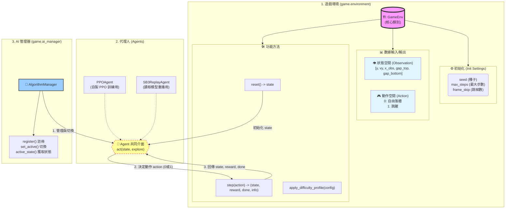

# Project API Documentation

## 1. 遊戲環境 (Game Environment)

核心環境類別位於 `game/environment.py`，模擬 Flappy Bird 的遊戲環境。

### `game.environment.GameEnv`

#### 初始化 (Initialization)
```python
env = GameEnv(seed=None, max_steps=None, frame_skip=4)
```
- **seed** (int, optional): 隨機種子，用於重現結果。
- **max_steps** (int, optional): 每個 Episode 的最大步數限制。
- **frame_skip** (int, default=4): 每個 `step` 執行的物理幀數 (Action Repeat)。

#### 狀態空間 (Observation Space)
返回一個包含 5 個浮點數的 Numpy Array (未標準化)：
`[y, vy, x_obs, y_gap_top, y_gap_bottom]`

- **y**: 玩家垂直位置。
- **vy**: 玩家垂直速度。
- **x_obs**: 距離下一個障礙物的水平距離。
- **y_gap_top**: 下一個障礙物缺口的頂部 Y 座標。
- **y_gap_bottom**: 下一個障礙物缺口的底部 Y 座標。

> **注意**: 實際返回給 Agent 的數值會經過標準化處理 (除以 `ScreenHeight` 等常數)。

#### 動作空間 (Action Space)
離散空間 (Discrete Space)，大小為 2：
- **0**: 不動作 (自由落體)。
- **1**: 跳躍 (施加向上衝量)。

#### 方法 (Methods)

- **`reset() -> state`**
  重置環境並返回初始狀態。

- **`step(action) -> (state, reward, done, info)`**
  執行一個動作並推進環境。
  - **state**: 新的狀態。
  - **reward**: 該步獲得的獎勵 (浮點數)。
  - **done**: 是否結束 (True/False)。
  - **info**: 額外資訊字典 (例如 `{"win": True}`, `{"passed_count": 10}`).

- **`apply_difficulty_profile(profile: dict)`**
  動態調整難度參數。
  ```python
  profile = {
      "ScrollSpeed": 3.0,
      "ObstacleSpacing": 200.0
  }
  env.apply_difficulty_profile(profile)
  ```

---

## 2. 代理人 (Agents)

代理人負責根據環境狀態做出決策。

### `agents.ppo_agent.PPOAgent`
一個輕量級的 PPO (Proximal Policy Optimization) 代理人實現。

#### 初始化
```python
agent = PPOAgent(lr=3e-4, device=None)
```

#### 方法
- **`act(state, explore: bool = False) -> (action, logp, value)`**
  - **state**: 環境狀態。
  - **explore**: 是否進行探索 (True: 隨機採樣, False: 確定性動作)。
  - **Returns**:
    - `action`: 選擇的動作 (0 或 1)。
    - `logp`: 動作的 Log Probability。
    - `value`: 狀態價值估計 (Value Function)。

### `agents.sb3_replay_agent.SB3ReplayAgent`
用於加載並重播 Stable-Baselines3 訓練好的模型。

#### 初始化
```python
agent = SB3ReplayAgent(model_path="path/to/model.zip", device="cpu")
```

#### 方法
- **`act(state, explore: bool = False) -> (action, logp, value)`**
  介面與 `PPOAgent` 保持一致，方便替換。

---

## 3. AI 管理器 (AI Manager)

`game/ai_manager.py` 負責管理多個演算法的註冊與切換。

### `game.ai_manager.AlgorithmManager`

#### 主要方法
- **`register(descriptor: AlgorithmDescriptor)`**
  註冊一個新的演算法。
- **`set_active(key: str)`**
  設定當前活躍的演算法。
- **`active_state() -> AlgorithmState`**
  獲取當前演算法的狀態 (包含 `agent`, `trainer` 等)。

---

## 4. 使用範例 (Usage Examples)

### 手動運行環境
```python
from game.environment import GameEnv

env = GameEnv(seed=42)
state = env.reset()
done = False

while not done:
    action = 1 # 總是跳躍
    state, reward, done, info = env.step(action)
    print(f"Reward: {reward}, Info: {info}")
```

### 加載訓練好的模型並運行
```python
from game.environment import GameEnv
from agents.sb3_replay_agent import SB3ReplayAgent

# 初始化環境與代理人
env = GameEnv()
agent = SB3ReplayAgent(model_path="best_model/ppo_game2048_6666_final.zip")

state = env.reset()
done = False

while not done:
    # Agent 決定動作 (explore=False 代表使用訓練好的最佳策略)
    action, _, _ = agent.act(state, explore=False)
    
    state, reward, done, info = env.step(action)
    
    if done:
        print("Game Over")
        print(f"Final Score: {info.get('passed_count', 0)}")
```

