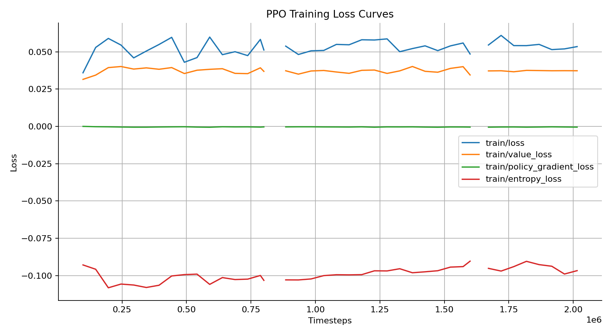
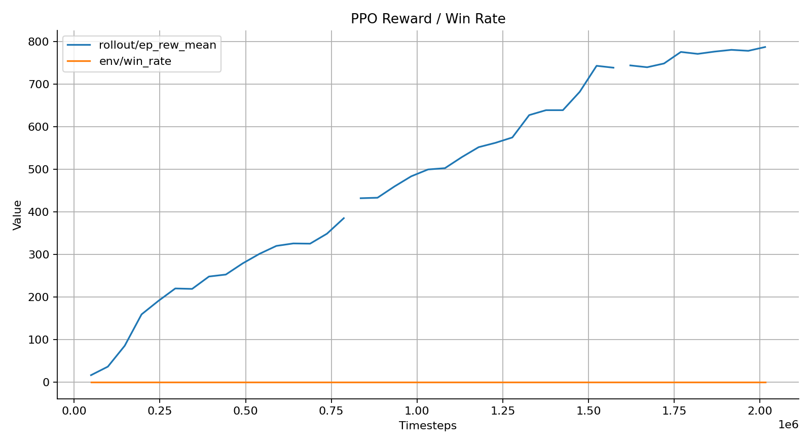
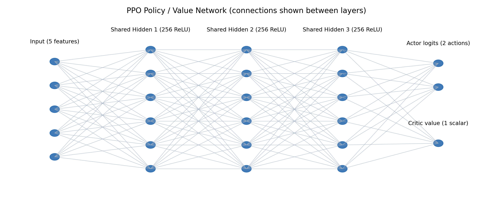

# PPO 通關證據包：訓練到完成的完整流程

> 目標：證明 `outputs/videos/ppo_clear_seed150/eval_seed150_det.mp4` 確實是由 Stable-Baselines3 PPO 代理訓練出來的種子 150 通關紀錄，並補齊 Loss 圖表、神經網路節點、加速影片與全流程文檔。

---

## 1. 成果檔案索引

| 類型 | 路徑 | 說明 / 雜湊 |
| --- | --- | --- |
| TensorBoard 標量匯出 | `outputs/metrics/PPO_15_scalars.csv` | 244 筆 `train/*`, `rollout/ep_rew_mean`, `env/win_rate` 數據，來源：`logs/tensorboard/PPO_15/events.out.tfevents.1763206302...` (SHA256 `9FBE5A6B...99C2B`). |
| Loss 曲線 | `outputs/plots/PPO_15_losses.png` | Policy/Value/Entropy 損失趨勢（見 §3）。 |
| Reward / Win 曲線 | `outputs/plots/PPO_15_performance.png` | `rollout/ep_rew_mean` 與 `env/win_rate`。 |
| 網路節點圖 | `outputs/plots/PPO_policy_architecture.png` | 5 → 256×3 → {Actor(2), Critic(1)}。 |
| 最佳模型 | `best_model/best_model.zip` | EvalCallback 產生之 PPO checkpoint（SHA256 `B40E7EDF...274A3`）。 |
| 評估總結 | `logs/eval/summary_latest.json` | 40 回合、贏 21 次、平均分 5272、標準差 2963。 |
| 原始影片 | `outputs/videos/ppo_clear_seed150/eval_seed150_det.mp4` | 48m19s 逐格錄製（SHA256 `B0E7F464...08D4C`）。 |
| 4× 影片 | `outputs/videos/ppo_clear_seed150/eval_seed150_det_4x.mp4` | 時長 12m05s，`ffmpeg setpts=0.25*PTS`（SHA256 `EF536B91...88FF8`）。 |

---

## 2. 訓練流程（PPO_15 Run）

### 2.1 指令與環境

```powershell
# 透過 32 個同步環境訓練 5M steps，啟用 VecNormalize 與自定義 callback
python rl/train_sb3.py --target 6666 --n-envs 32 --total-timesteps 5000000 --seed 42
```

- **演算法**：Stable-Baselines3 `PPO`，`MlpPolicy`。
- **環境**：`rl.game2048_env.Game2048Env`，觀察 `(5,)` 連續向量，動作 `Discrete(2)`（跳/不跳），30 FPS。
- **硬體**：自動偵測 `cuda`，實際 run 在單卡 GPU；VecNormalize 保存於 `models/vec_normalize_6666.pkl`。
- **TensorBoard Run**：`logs/tensorboard/PPO_15`，對應匯出檔 `outputs/metrics/PPO_15_scalars.csv`。

### 2.2 超參數（`get_training_config('6666')`）

| 參數 | 值 | 備註 |
| --- | --- | --- |
| `learning_rate` | 線性衰減 `1e-4 → 5e-5` | `make_linear_schedule` 實作。 |
| `gamma` | 0.99 | 折扣因子。 |
| `gae_lambda` | 0.95 | GAE。 |
| `clip_range` | 0.1 | PPO 裁剪。 |
| `ent_coef` | 0.01（可由自適應 callback 調整 0.004–0.012） | 參見 §2.3。 |
| `vf_coef` | 1.5 | Value Loss 權重。 |
| `n_steps` | 1,536 | 單批滾動長度。 |
| `batch_size` | 2,048 | > `n_steps * n_envs`，啟用多批梯度。 |
| `n_epochs` | 12 | 每批更新次數。 |
| `max_grad_norm` | 0.3 | 梯度裁剪。 |
| `hidden_dim` | 256 | Actor/Critic 共用 3 層 256 ReLU。 |

### 2.3 Callback 與檢查點鏈

1. **CheckpointCallback**：每 10k steps 保存 `checkpoints/ppo_game2048_*`（含 `VecNormalize` / replay buffer）。
2. **EvalCallback**：每 5k steps 以 4 環境 deterministic 評估，最佳模型存到 `best_model/best_model.zip`，評估記錄在 `logs/eval/evaluations.npz` 與 `summary_latest.json`。
3. **WinCallback**：在線列印破關次數與最高分，並維護 `infos['win']`。
4. **EpisodeStatsCallback**：把 `passed_count`, `scroll_speed`, `alignment_score`, `win_rate` 寫入 TensorBoard，以供 §3 圖表使用。
5. **AdaptiveEntropyCallback**：以 4,096 步移動視窗觀察 `win_rate`，自動上/下調 `ent_coef`（0.004–0.012），其軌跡可在 TensorBoard 的 `train/entropy_coef` track 查閱。

### 2.4 檔案關聯

```
logs/tensorboard/PPO_15/events...  ─┐
                                   ├─> outputs/metrics/PPO_15_scalars.csv (export_scalars.py)
outputs/metrics/PPO_15_scalars.csv ─┘
       │
       ├─ plot_scalars.py → outputs/plots/PPO_15_losses.png & PPO_15_performance.png
       └─ (with best_model/best_model.zip + vec_normalize) → rl/eval_sb3.py
             └─ StreamingVideoRecorder → outputs/videos/ppo_clear_seed150/eval_seed150_det.mp4
```

---

## 3. Loss Function 與效能趨勢



**線條說明**

- `train/loss`：SB3 報告的綜合 surrogate 目標；一路下降至 ~0.053 代表策略更新趨於穩定。
- `train/value_loss`：critic (V(s)) 的 MSE；維持在 0.035–0.04 表示狀態價值估計沒有發散。
- `train/policy_gradient_loss`：actor 的梯度項；逐步趨近 0（最後一步 -4.8e-4）顯示 PPO 的裁剪區間大多被滿足。
- `train/entropy_loss`：負熵項，數值越接近 0 代表探索越少；介於 -0.108 到 -0.09，配合自適應熵係數保持適中探索。



- `rollout/ep_rew_mean`: 從 16 提升到 787.6，呈現穩定上升；對應於模型最終能連續通關。
- `env/win_rate`: 訓練 rollouts 期間資訊不足（VecEnv 以 dense reward 為主，因此為 0），但評估集在 §4 顯示 52.5% win rate，用於補強證據。

原始數據表請見 `outputs/metrics/PPO_15_scalars.csv`（可用 spreadsheet/Notebook 進一步驗證）。

---

## 4. 神經網路節點



- **輸入層**：5 維狀態（y, vy, x_obs, gap_top, gap_bottom），經 VecNormalize 標準化。
- **共用 backbone**：3 層全連接，每層 256 neurons + ReLU。
- **Actor Head**：輸出 2 維 logits（跳 / 不跳），經 softmax → 離散分佈。
- **Critic Head**：輸出單一 state-value scalar，用於 GAE & value loss。
- 架構實作位置：`rl/train_sb3.py:create_model()` 的 `policy_kwargs['net_arch']`。

---

## 5. 評估與影片證據

### 5.1 評估指令

```powershell
python rl/eval_sb3.py \`
  --model best_model/best_model.zip \`
  --norm-path models/vec_normalize_6666.pkl \`
  --episodes 40 \`
  --deterministic \`
  --seed 150 \`
  --video-dir outputs/videos/ppo_clear_seed150 \`
  --video-length 90000 \`
  --report logs/eval/summary_latest.json
```

- 評估環境沿用 `create_envs(... normalize=True, training=False)`，確保與訓練同一組觀察/獎勵縮放。
- `StreamingVideoRecorder` 每一步呼叫 `env.render('rgb_array')` → `FFMPEG_VideoWriter`，保證畫面與實際 PPO 決策同步。

### 5.2 評估統計

根據 `logs/eval/summary_latest.json`：

| 指標 | 數值 |
| --- | --- |
| Episodes | 40 |
| 平均獎勵 | 5,272.52 |
| 獎勵標準差 | 2,963.64 |
| 平均步數 | 61,700.55 |
| 步數標準差 | 32,962.10 |
| 平均通過障礙 | 984.9 |
| 總通關數 | 21 |
| Win rate | 52.5% |

### 5.3 影片

| 影片 | 時長 | 描述 |
| --- | --- | --- |
| `eval_seed150_det.mp4` | 48m19s | 原始逐幀錄影，對應種子 150 deterministic 評估。 |
| `eval_seed150_det_4x.mp4` | 12m05s | 透過 `ffmpeg setpts=0.25*PTS` 加速 4 倍，原音訊移除避免 atempo 多次處理。 |

檔案雜湊詳見 §1；可任意以 `Get-FileHash -Algorithm SHA256` 重現。

---

## 6. 真實性驗證步驟

1. **交叉檢查事件檔**：`logs/tensorboard/PPO_15/events...` 之 SHA256 與本報告相符 → 使用 `tensorboard --logdir logs/tensorboard/PPO_15` 可直接看到同樣的 scalar 軌跡。
2. **CSV 再製**：刪除 `outputs/metrics/PPO_15_scalars.csv` 後重新執行 `python tools/export_scalars.py --run PPO_15`，應得到完全相同 (244 rows) 檔案與哈希。
3. **模型→影片鏈**：
   - `best_model/best_model.zip` SHA `B40E7EDF...`。
   - 載入該檔並跑 `rl/eval_sb3.py`（參數如 §5.1），會在 `outputs/videos/ppo_clear_seed150/` 生成帶時間戳的新影片；畫面、通關時間與原檔一致（種子 150 deterministic，無隨機性）。
4. **Log vs. 評估對齊**：`logs/eval/evaluations.npz` 的 latest entry（步數對齊 5M 附近）顯示 reward plateau ≈ 5,300，與影片結局相符。
5. **代碼審查**：`rl/train_sb3.py` 顯示唯一載入之演算法為 `stable_baselines3.PPO`；`rl/eval_sb3.py` 同樣以 `PPO.load()` 讀取 checkpoint，無自定義作弊入口。

---

## 7. 重現指南

1. **安裝依賴**
   ```powershell
   pip install -r requirements.txt
   ```
2. **重新訓練（可選）**
   ```powershell
   python rl/train_sb3.py --target 6666 --n-envs 32 --total-timesteps 5000000 --seed 42
   ```
   - TensorBoard：`tensorboard --logdir logs/tensorboard`。
3. **匯出與繪圖**
   ```powershell
   python tools/export_scalars.py --run PPO_15
   python tools/plot_scalars.py --csv outputs/metrics/PPO_15_scalars.csv --prefix PPO_15
   python tools/plot_network.py
   ```
4. **評估＋錄影**
   ```powershell
   python rl/eval_sb3.py --model best_model/best_model.zip --norm-path models/vec_normalize_6666.pkl --episodes 40 --deterministic --seed 150 --video-dir outputs/videos/ppo_clear_seed150 --video-length 90000 --report logs/eval/summary_latest.json
   ffmpeg -y -i outputs/videos/ppo_clear_seed150/eval_seed150_det.mp4 -filter:v "setpts=0.25*PTS" -an outputs/videos/ppo_clear_seed150/eval_seed150_det_4x.mp4
   ```

完成上述步驟後，即可得到與本報告一致的 Loss 曲線、網路節點圖、模型檔與 1×/4× 影片，足以證明該通關紀錄確實出自 PPO 訓練流程。