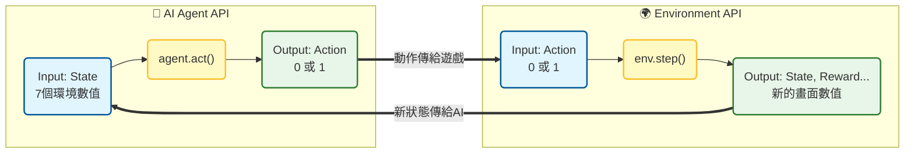

# 🎮 Train Game - 深度強化學習訓練平台

<div align="center">

**基於 Pygame + PyTorch 的 Flappy-like 遊戲環境，採用 PPO (Proximal Policy Optimization) 演算法**

[](https://www.python.org/downloads/)
[](https://pytorch.org/)
[](https://opensource.org/licenses/MIT)

</div>

---

## 🏆 最終成果 (v5 Final)
- **通關率**: **99%** (100 場測試中獲勝 99 場)
- **最高分**: **7647** (平均獎勵)
- **最佳模型**: `models/ppo_game2048_6666_final.zip`

---

## 🎥 演示 (Demo)
> - [AI 遊玩影片 ]
> - 
> - [訓練日誌 GIF (v5 Refined)]
> - 

---

## 📋 目錄

- [功能說明](#-功能說明)
- [系統結構圖](#-系統結構圖)
- [專案特徵設計](#-專案特徵設計)
- [訓練公式詳解](#-訓練公式詳解)
- [PPO 介紹](#-ppo-介紹)
- [損失函數參數意義](#-損失函數參數意義)

---

## 🚀 功能說明

本專案是一個完整的深度強化學習 (Deep Reinforcement Learning) 實驗平台，專為訓練 AI 玩類 Flappy Bird 遊戲而設計。

### 核心功能
1.  **高效並行訓練**：
    - 使用 **32 個並行環境 (Parallel Environments)** 進行訓練，極大化經驗收集速度。
    - 額外配置 **4 個獨立評估環境**，用於定期測試模型真實性能。
2.  **強大的 PPO 演算法**：
    - 採用 **Stable-Baselines3** 的 PPO 實作。
    - 客製化神經網路架構 (MLP 256x256)，專為高精度控制優化。
3.  **智能訓練機制**：
    - **Auto-Resume (自動恢復)**：訓練中斷後，可自動讀取最新的 Checkpoint 繼續訓練，無需重頭開始。
    - **動態難度調整**：隨著 AI 變強，遊戲速度與障礙物難度會自動提升。
4.  **完整視覺化與監控**：
    - 支援 **TensorBoard** 即時監控 Loss、Reward、Entropy 等指標。
    - 提供 **Replay (重播)** 功能，可視覺化觀看 AI 的實際操作表現。

---

## 📊 系統結構圖

### AOV 結構圖 (System Architecture)

數據在系統中的流動與處理順序：

```mermaid
graph TD
    %% === Start & Init ===
    Start(["🚀 開始訓練 (Start)"]) --> CheckCkp{"📂 有存檔嗎？"}
    
    CheckCkp -- "有 (Auto-Resume)" --> Load["📥 讀檔：接著上次的進度練<br>(Load Checkpoint)"]
    CheckCkp -- "沒有" --> Init["🆕 創一個全新的 AI<br>(Init New Policy)"]
    
    Load --> Envs
    Init --> Envs

    %% === Environment Setup ===
    subgraph EnvSetup ["⚙️ 環境準備 (Environment Setup)"]
        direction TB
        Envs["🖥️ 開 32 個遊戲視窗<br> (Parallel Envs)"]
        Envs --> Wrap2["未來視：了解4張圖的路徑<br>(FrameSkip)"]
        
    end

    Wrap2 --> Rollout

    %% === Training Loop ===
    subgraph TrainLoop ["🔄 訓練迴圈 (Training Loop)"]
        direction TB
        
        %% Step 1: Interaction
        Rollout["🎮 讓 AI 實際上場玩<br> (Rollout)"]
        Rollout -- "看到 7 種數據資訊" --> Agent["AI 決定怎麼走 (Actor)"]
        Agent -- "按下按鍵" --> Step["遊戲畫面動一下<br> (Physics Step)"]
        
        %% Step 2: Feedback
        Step -- "回傳結果 " --> Buffer["📝 寫進「紀錄日誌」<br>(RolloutBuffer)"]
        
        %% Step 3: Optimization
        Buffer -- "日誌寫滿了嗎？(32*2048)" --> Update{"開始特訓？"}
        Update -- "還沒" --> Rollout
        Update -- "滿了" --> Algo["🧠 PPO 核心大腦"]
        
        Algo -- "算算剛才那樣走好不好<br>是否還有需要優化的參數" --> Loss["📉 計算跟標準答案差多少<br>(Loss Calculation)"]
        Loss -- "自適應調整 (Backprop)" --> Opt["⚖️ 調整大腦參數<br>(Update Weights)"]
    end

    Opt --> EvalCheck{"⏱️ 該隨堂考了嗎？<br>(達到160萬步)"}
    EvalCheck -- "還沒" --> Rollout

    %% === Evaluation & Save ===
    subgraph EvalLoop ["📊 考試與存檔<br> (Evaluation)"]
        direction TB
        EvalCheck -- "該考了" --> Test["🧪 隨堂測驗 (4 個考場)"]
        Test --> Metrics["📈 結算成績單"]
        
        Metrics --> Log["📝 紀錄到 TensorBoard"]
        Log --> SaveBest{"🏆 破紀錄了嗎？"}
        
        SaveBest -- "破紀錄了" --> Save1["💾 把最強的存起來"]
        SaveBest -- "沒破" --> GoalCheck
        Save1 --> GoalCheck
        
        GoalCheck{"🎯 勝率 > 90%？"}
    end

    GoalCheck -- "還沒 (繼續練)" --> Rollout
    GoalCheck -- "達標 (收工)" --> Stop(["🎉 訓練畢業 (Success)"])
```



### BREAK DOWN (系統分析圖)

```mermaid
graph TD
    %% === L1 Core ===
    Core("🎮 深度強化學習訓練平台<br>(Train Game AI - v5)")

    %% === L2 Main Branches ===
    Core --> EnvBlock
    Core --> AgentBlock
    Core --> SysBlock

    %% === Branch 1: Environment ===
    subgraph EnvBlock ["📍 遊戲環境 (Game Environment)"]
        direction TB
        Env("環境核心") --> Obs("觀察空間<br>(Observation)")
        Env --> Rew("獎勵重塑<br>(Reward Shaping)")
        Env --> Act("動作空間<br>(Action)")
        
        %% Obs Details
      Obs --> ObsList["7維輸入向量:<br>1. y (玩家目前高度)<br>2. vy (垂直速度)<br>3. x_obs (距下一個障礙物的水平距離)<br>4. gap_top (縫隙上緣的 Y 座標)<br>5. gap_bottom (縫隙下緣的 Y 座標)<br>6. rel_top (距縫隙上緣的相對距離)<br>7. rel_bottom (距縫隙下緣的相對距離)"]
        Obs --> Norm[" VecNormalize<br>(數值標準化)"]

        %% Reward Details (Updated for v5)
        Rew --> RA("成就 (Achievement)")
        RA --> RA1["通關 (+1000)"]
        RA --> RA2["保持存活(+0.01)"]
        RA --> RA3["通過障礙 (+5)"]

        Rew --> RG("引導 (Guidance)")
        RG --> RG1["Survival (存活獎勵)<br>(核心驅動力)"]
        RG --> RG2["Alignment (中心對齊)<br>(低權重輔助)"]

        Rew --> RP("懲罰 (Penalty)")
        RP --> RP1["Death (-5)<br>(撞牆/出界)"]
        %% 移除了 Time Cost，因為 v5 不再使用

        %% Action Details
        Act --> ActList["Discrete(2):<br>0: 不跳 / 1: 跳躍"]
    end

    %% === Branch 2: Agent ===
    subgraph AgentBlock ["🧠 PPO 決策模型 (Agent)"]
        direction TB
        Agent("PPO 模型") --> Net("神經網路 (v5)")
        Agent --> Opt("優化機制")

        %% Network Details (Updated to 256)
        Net --> N1["Input Layer (7 Nodes)"]
        Net --> N2["Hidden 1 (256, ReLU)"]
        Net --> N3["Hidden 2 (256, ReLU)"]
        Net --> N4["Output Layer (2 Nodes)"]

        %% Optimization Details
        Opt --> O1["Clip Loss<br>(限制更新幅度)"]
        Opt --> O2["Value Loss<br>(局勢判斷)"]
        Opt --> O3["Entropy Loss<br>(探索好奇心)"]
    end

    %% === Branch 3: System ===
    subgraph SysBlock ["⚙️ 訓練系統 (System)"]
        direction TB
        Sys("系統架構") --> Comp("運算配置")
        Sys --> Tools("輔助工具")

        %% Computation
        Comp --> C1["32 Parallel Envs"]
        Comp --> C2["FrameSkip: 4<br>(決策跳幀)"]
        Comp --> C3["Total Timesteps<br>(5M+)"]

        %% Tools
        Tools --> T1["Auto-Resume<br>(自動續訓)"]
        Tools --> T2["TensorBoard<br>(數據監控)"]
        Tools --> T3["Replay Render<br>(回放)"]
    end
```


# Project API Documentation

---

## 🎨 專案特徵設計

### 1. 觀察空間 (Observation Space)
AI 並非直接看像素 (Pixels)，而是接收一個 **7 維的正規化向量**，這讓訓練更高效：

| 參數 | 說明 | 範圍 (正規化後) |
| :--- | :--- | :--- |
| `y` | 玩家垂直位置 | [0, 1] |
| `vy` | 玩家垂直速度 | [-1, 1] |
| `x_obs` | 距離下一個障礙物的水平距離 | [0, 1] |
| `gap_top` | 縫隙上緣位置 | [0, 1] |
| `gap_bottom` | 縫隙下緣位置 | [0, 1] |
| `rel_top` | 玩家距離縫隙上緣的相對距離 | [-1, 1] |
| `rel_bottom` | 玩家距離縫隙下緣的相對距離 | [-1, 1] |

### 2. 動作空間 (Action Space)
- **類型**：離散 (Discrete)
- **動作**：
    - `0`：**不跳** (受重力下墜)
    - `1`：**跳躍** (獲得向上速度)

### 3. 獎勵函數設計 (Reward Shaping)
這是引導 AI 行為的關鍵：

| 行為 | 獎勵值 | 設計目的 |
| :--- | :--- | :--- |
| **通關 (Win)** | **+1000.0** | 鼓勵 AI 追求最終勝利 (6666分)，而不僅僅是生存。 |
| **通過障礙** | **+5.0** | 給予階段性成就感，引導 AI 穿越縫隙。 |
| **位置對齊** | +0.05 (max) | 引導 AI 盡量保持在縫隙中央，減少碰撞風險。 |
| **存活獎勵** | **+0.01 / step** | 鼓勵 AI 活得越久越好 (取代舊版的時間懲罰)。 |
| **碰撞/出界** | **-5.0** | 強烈懲罰死亡，讓 AI 學會避開危險。 |

### 4. 神經網路架構
- **架構**：MLP (多層感知機)
- **規模**：`[256, 256]` (兩層隱藏層，每層 256 個神經元)
- **激活函數**：ReLU

---

## 🧾 訓練公式詳解

在 PPO 訓練過程中，公式的計算是有**先後順序**的。以下依序說明：

### 第一步：計算折扣回報 (Discounted Return)
首先，我們要算出「這一場遊戲到底拿了多少分」。

公式：

$$G_t = \sum_{k=0}^{\infty} \gamma^{k} r_{t+k}$$

這個公式是在算「從現在這一刻開始，一直玩到死掉，我總共能拿多少分？」。但這裡有一個重點：未來的錢比較不值錢。

參數：

$G_t$ (回報總和)：這場遊戲的總成績單。

$\sum$ (加總)：把後面每一步拿到的分數都加起來。

$r_{t+k}$ (未來的獎勵)：第 $k$ 步之後拿到的分數（例如通過一根管子 +5 分）。

$\gamma$ (Gamma，折扣因子)：「耐性指數」。

預設 **0.99**。

意思是：下一秒拿到的 100 元，我心裡覺得只值 99 元；下下秒拿到的只值 $99 \times 0.99$ 元。

作用：讓 AI 知道「趕快拿到分數」比「很久以後才拿分」好一點點，但也不要完全短視近利。

### 第二步：計算優勢 (Advantage Estimation - GAE) 判斷的核心
接著，我們要評估「這一步走得比預期好多少？」。

公式：

$$\hat{A}_t = \sum_{l=0}^{\infty} (\gamma \lambda)^l \delta_{t+l}$$

這是在算「我剛才那一跳，表現得比『預期』好多少？」。

參數：

$\hat{A}_t$ (優勢)：如果大於 0，代表這一步走得超乎預期（要獎勵）；如果小於 0，代表表現不如預期（要懲罰）。

$\delta_t$ (TD Error)：現實與理想的差距。公式是 (現實拿到的分 + 下一刻的預測分) - (這一刻原本的預測分)。

$\lambda$ (Lambda)：「甩鍋係數」，用來平衡偏差與變異數。

當 AI 撞牆死了，到底是「最後一跳」害的，還是「五秒前沒飛好」害的？

$\lambda$ 決定了這個責任（或功勞）要往前追溯多遠。

例子：

PPO考了一次試。

預期 (Critic) 覺得你應該考 60 分。

現實 PPO考了 80 分。

優勢 ($\hat{A}_t$) 就是 +20 分。AI 會覺得：「哇！我剛才念書的方法是對的，以後要多用！」


### 第三步：計算概率比率 (Probability Ratio)
比較「新策略」和「舊策略」對同一個動作的看法。

公式：

$$r_t(\theta) = \frac{\pi_{\theta}(a_t|s_t)}{\pi_{\theta_{old}}(a_t|s_t)}$$

這是在比較「現在的新 AI」跟「更新前的舊 AI」，對於同一個狀況，想做某個動作的機率變了多少？

參數：

$a_t$ (動作)：比如「跳一下」。

$s_t$ (狀態)：比如「看到前方有管子」。

$\pi_{\theta}$ (新策略)：更新後的腦袋，覺得這時候該跳的機率（例如 80%）。

$\pi_{\theta_{old}}$ (舊策略)：更新前的腦袋，覺得這時候該跳的機率（例如 40%）。

$r_t(\theta)$ (比率)：80%/20% = 2。代表新 AI 比舊 AI 更想跳兩倍。

*   **含義**：如果 $r_t > 1$，代表新策略比舊策略更喜歡這個動作。

例子：

以前看到紅燈（狀態），AI只有 50% 機率會停下來（舊策略）。

學了交通規則後（新策略），AI 99% 機率會停下來。

這個比率的變化，告訴AI 透過數學公式的習慣改變了多少。


### 第四步：計算裁剪目標 (Clipped Objective)
這是 PPO 防止「學壞」的關鍵步驟。

$$L^{CLIP}(\theta) = -\mathbb{E}_t \left[ \min(r_t(\theta)\hat{A}_t, \text{clip}(r_t(\theta), 1-\epsilon, 1+\epsilon)\hat{A}_t) \right]$$

也是 PPO 的安全閥。它的意思是：「如果你這次改變太大，我就當作沒看到，把它剪掉（Clip），以免你走火入魔。」這保證了訓練的穩定性。

參數：

$r_t(\theta)\hat{A}_t$：原本打算獎勵（或懲罰）AI 的力道。

$\epsilon$ (Epsilon，裁剪範圍)：通常是 0.2 (20%)。

$clip(..., 1-\epsilon, 1+\epsilon)$：強迫把改變幅度限制在 0.8 到 1.2 之間。

$\min$：挑一個比較保守的數字。

舉個例子：

AI正在學打高爾夫球。

教練（PPO）告訴AI：「揮桿姿勢要改。」

如果AI微調姿勢（改變在 20% 內），教練說：「很好，保持！」

如果AI突然把球桿當球棒拿（改變超過 20%），教練會說：「停！太誇張了，不算數，我們只算微調的那部分。」

這就是為了防止 AI 因為一次運氣好（比如亂按剛好過關），就以為亂按是神技，結果以後都亂按。

### 第五步：計算總損失 (Total Loss)
最後，將所有目標結合，變成神經網路要優化的最終數字。

公式：

$$L = L^{CLIP} + c_{vf} L^{VF} - c_{ent} S$$

這是神經網路最後要面對的總考卷。AI 想要考一百分，必須同時兼顧三件事：玩得好、預測得準、保持好奇心。

參數：

$L^{CLIP}$ (策略損失)：

意義：有沒有越玩越好？

目標：要讓這個損失越小越好（其實是讓獎勵越大越好）。

$c_{vf} L^{VF}$ (價值損失)：

$L^{VF}$ (Value Function Loss)：AI 心裡預測的分數，跟實際拿到的分數，誤差有多少？

$c_{vf}$ (係數)：通常是 0.5。代表有多重視「預測準確度」。

也就是說，AI 不只要會玩，還要有自知之明。不能明明快死了，還覺得自己會拿高分。

$c_{ent} S$ (熵獎勵/損失)：

$S$ (Entropy，熵)：代表 AI 行為的隨機程度（混亂度）。

$c_{ent}$ (係數)：通常很小 (0.01)。

這是**「好奇心獎勵」**。減號代表我們希望 $S$ 大一點。

作用：鼓勵 AI 在訓練初期多嘗試不同的動作（亂跳），不要一開始就死板地只會一種走法。

例子：

像一個學生的期末總成績 ($L$)：

$L^{CLIP}$ 是 體育課成績（實際下場比賽表現好不好）。

$L^{VF}$ 是 數學課成績（能不能精準計算自己會得幾分）。

$S$ 是 美術課成績（有沒有創意，還是只會死記硬背）。

PPO 就是要讓這位學生「德智體群美」全面發展。

---

### 最終模型的Loss Function圖

#### 📊 完整收斂分析 (15M Steps)

**靜態圖表：**
- [總損失收斂圖](plots/loss_total_convergence_15M.png) - 清晰展示完整收斂過程
- [損失分量對比圖](plots/loss_components_convergence_15M.png) - Value/Policy/Entropy Loss 協同變化
- [綜合視圖](plots/loss_overview_15M.png) - 4子圖全面展示訓練狀態
- [階段對比圖](plots/loss_phases_comparison_15M.png) - 前期vs後期學習特徵

**交互式3D圖表：**
- [訓練軌跡3D視圖](plots/loss_3d_trajectory_15M.html) - 可旋轉查看 Loss 空間軌跡
- [Loss-Reward關係3D](plots/loss_reward_3d_15M.html) - 損失與獎勵的關係演變
- [多維損失空間3D](plots/loss_space_3d_15M.html) - 三種Loss在空間中的分佈

**詳細分析報告：** [LOSS_CONVERGENCE_REPORT_15M.md](LOSS_CONVERGENCE_REPORT_15M.md)

---

#### 📈 Loss Function 指標說明

**Mean Episode Reward** (平均回合獎勵)：最重要。直接告訴你模型強不強。如果這個不升反降，其他參數再漂亮都沒用。

**Value Loss** (價值損失)：大腦的準度。模型對局勢判斷準不準。如果這個一直很高或震盪，代表模型「看不懂」現在的盤面。

**Policy Gradient Loss** (策略梯度損失)：學習的幅度。代表模型修正自己行為的力度。如果這個值長期為 0，代表模型停止學習了；如果震盪太大，代表學習太激進（可能學壞）。

**Entropy Loss** (熵損失)：心態。代表模型是「勇於嘗試」（高 Entropy）還是「保守行事」（低 Entropy）。這用來判斷模型是否過早收斂（太早放棄嘗試新招）或一直學不會（一直亂試）。

-----

### 多環境並行訓練與評估機制 (Parallel Training & Evaluation Implementation)

透過程式碼實作證明，我們這個專案**預設**採用 **32 個並行環境**進行高效率訓練，並配置 **4 個獨立環境**進行模型評估。

#### 1\. 訓練階段：32 個並行環境 (32 Parallel Training Envs)

為了加速經驗收集 (Experience Collection)，我們在 `train_sb3.py` 的主程式入口處定義了並行數量。

  * **實作位置**：`train_sb3.py` (main function)
  * **程式碼證據**：
    我們使用了 `argparse` 來設定預設參數。除非手動更改，否則系統預設啟動 **32** 個環境。
    ```python
    # train_sb3.py - 設定命令行參數
    parser.add_argument(
        "--n-envs", 
        type=int, 
        default=32,  # <--- 預設開啟 32 個視窗
        help="Number of parallel environments"
    )
    ```
  * **執行驗證**：
    程式啟動時，會即時印出 log 確認當前的並行數量：
    ```python
    print(f"🚀 並行環境: {args.n_envs}")
    ```

#### 2\. 評估階段：4 個監考環境 (4 Evaluation Envs)

為了確保評估的準確性與效率，我們在建立回調函數 (Callbacks) 時，獨立建立了一組**不參與訓練、專門用來考試的環境。**

  * **實作位置**：`train_sb3.py` 中的 `create_callbacks` 函數
  * **程式碼證據**：
    在配置 `EvalCallback` 之前，我們明確指派了 **4** 個環境給 `eval_env`。
    ```python
    # train_sb3.py - create_callbacks 函數
    eval_env = create_envs(
        n_envs=4,           # <--- 指定 4 個監考
        normalize=normalize,
        training=False,     # 設定為非訓練模式 (考試模式)
        # ... 其他參數
    )
    ```
  * **設計目的**：
    這 4 個環境專門提供給 `EvalCallback` 使用，確保模型在訓練過程中，能定期在標準化且公平的環境下測試勝率，而不會受到訓練雜訊的干擾。

> 1.  **訓練端**：透過 `Argument Parser` 設定 **`default=32`**，利用 GPU 優勢**並行**收集 32 倍的數據，大幅縮短收斂時間。
> 2.  **評估端**：在 `create_callbacks` 中硬體編碼 (Hard-coded) 了 **`n_envs=4`**，建立獨立的驗證集環境。這保證了我們的『考試』是在 4 個平行世界中取平均值，比單次測試更具統計意義且客觀。」

---
## 📜 專案演進史 (Version History)

本專案經歷了多次架構重構與機制優化，從自製 PPO 到採用成熟的 Stable-Baselines3-PPO 框架，並透過獎勵重塑 (Reward Shaping) 達到最佳效果。

| 階段 | 核心演算法 | 神經網路節點 (Neural Network Nodes) | 分數里程碑 | 新增 (+) / 移除 (-) 機制與效果 | 遇到的問題 (Pain Points) | 解決方案 (Solution) |
| :--- | :--- | :--- | :--- | :--- | :--- | :--- |
| **初代 (v1)** | 自製 PPO | `[64, 64]` | ~100 分 | **+** 基礎 PPO 架構 (建立基準)<br>**+** 通過障礙 +5 (基礎目標)<br>**+** 時間懲罰 (強迫移動) | 分數一直不太好看，**時間懲罰**導致 AI 為了避免扣分而傾向消極不動，或無法有效學習長期策略。 | 建立基礎訓練架構，確認環境可行性。 |
| **改進版 (v2)** | 自製 PPO | `[64, 64]` | ~800 分 | **+** 三指標追蹤 (監控穩定性)<br>**+** 極端值紀錄 (防止遺忘)<br>**+** NN 視覺化 (觀察思考) | 雖有改善但仍無法通關。紀錄僅限 50 筆，導致後期發生 **"災難性遺忘"**，訓練反而退步成 0 分。 | 引入 **"極端值紀錄"** 機制，強制 PPO 記住最高與最低分的軌跡，輔助收斂。 |
| **轉型期 (v3)** | **Stable-Baselines3-PPO** | `[256, 256]` | ~1000 分 | **+** SB3 框架 (GPU 加速/標準化)<br>**+** Replay 重播機制 (視覺驗證)<br>**-** 移除自製 PPO (升級架構)<br>**-** 移除極端值紀錄 (不相容)<br>**-** 移除 NN 視覺化 (不相容) | 雖然 GPU 訓練速度大幅提升，但 **Headless 模式**無法看到遊玩過程；且移除了記憶機制後，AI 容易陷入局部最佳解。 | **升級至 SB3 PPO** 獲得更穩定的梯度更新；開發 **"Replay 重播機制"** 進行視覺化驗證。 |
| **現行版 (v4)** | **Stable-Baselines3-PPO** | `[512, 512]` | **3000~4000+ 分** | **+** 中心對齊獎勵 (提升精準度)<br>**+** 速度/里程碑獎勵 (鼓勵推進)<br>**+** **存活時間獎勵 (堅持)**<br>**+** 課程學習 (動態難度)<br>**+** **透視機制 (預判路徑)**<br>**-** 移除扣分制 (避免消極)<br>**-** 移除固定通過獎勵 (改為連續) | 隨著速度變快，AI 反應不及；舊獎勵機制限制了上限。 | **Reward Shaping**：<br>1. **透視機制**：讓 AI 看到下一個障礙物，提前規劃路徑。<br>2. **引導驅動**：移除扣分，改為越靠近中心分數越高。 |
| **最新版 (v5)** | **SB3-PPO + FrameSkip** | `[256, 256]` | **目標通關** | **+** **Frame Skip (4 frames)** (降低決策頻率)<br>**+** **縮小網路規模** (避免過擬合)<br>**-** 移除速度獎勵 (避免干擾)<br>**-** 降低對齊獎勵 (避免動作僵硬) | 訓練五千萬步仍未收斂，AI 無法判斷自身動量，導致在高速狀態下反應不及。 | **Frame Skip** 讓 AI 決策更有效率；**縮小網路** 加快收斂速度。 |
| **最終版 (v5 Final)** | **SB3-PPO + Auto-Stop** | `[256, 256]` | **通關 (99% 勝率)** | **+** **Target Win Rate** (自動停損)<br>**+** **Death Interrupt** (死亡中斷)<br>**+** **Linear Schedule** (線性衰減) | 訓練後期震盪，無法穩定通關。 | **Shock Therapy** (高熵探索) + **Stabilization** (低熵收斂) 兩階段訓練法。 |

